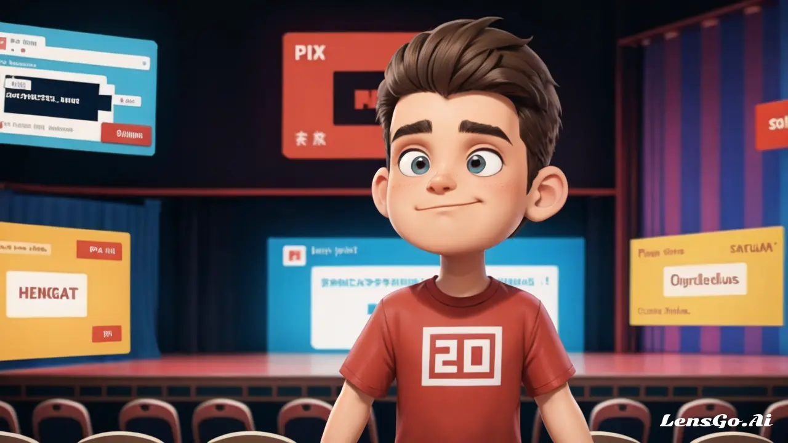

As a dedicated frontend engineer, complacency is not an option. Staying at the forefront of technology is vital to navigate the ever-evolving landscape and provide innovative solutions to your clients. In this article, we'll explore four unconventional approaches to keeping up with frontend tech that don't involve traditional blogs or podcasts.

## 1. Follow the Titans

One effective way to stay informed is by closely monitoring the thought leaders in the industry. These experts not only share their extensive knowledge but also disseminate the latest developments in frontend technology. For instance, Addy Osmani, a prominent figure in this field, is renowned for publishing cutting-edge research and providing real-time updates via Twitter or follow their talks or conferences. Here are some more influential figures to follow:

- Ben Frain
- Jake Archibald
- Lea Verou
- Addy Osmani
- David Walsh
- John Resig
- Paul Irish
- Alex Russell
- Chris Coyier
- Chris Lilley
- Dan Abramov
- David Khourshid
- Harry Roberts
- Kent C. Dodds
- Lin Clark
- Nicole Sullivan
- Sara Soueidan
- Wes Bos

## 2. Embrace Conferences and Meetups

Frontend conferences and meetups are a treasure trove of insights. While it might not be feasible to watch every presentation on YouTube, you can gain valuable information by skimming through the talk titles. If a particular topic repeatedly surfaces, it's a clear indication of its significance. Here are some noteworthy conferences and meetups to keep an eye on:

Conferences:

- Smashing Conference (San Francisco, CA, USA)
- React Advanced (London, UK)
- VueConf (Multiple locations)
- Svelte Summit (Multiple locations)
- CSSConf (Multiple locations)
- Front-end Developers Conference (Multiple locations)
- Full-Stack Web Dev Conference (Multiple locations)
- JavaScript Conference (Multiple locations)

Meetups:

- Front-End Developers Meetup
- React Meetup
- Vue Meetup
- Svelte Meetup
- CSS Meetup
- Full-Stack Web Dev Meetup
- JavaScript Meetup
- Web Performance Meetup
- Accessibility Meetup

## 3. Dive into the Specs

Frontend development thrives on open standards, and there are no secrets in this domain. A true professional must dive into the technical specifications. Keep a vigilant eye on the following organizations and their corresponding standards:

- For JavaScript, stay updated with TC39.
- For HTML and CSS, rely on W3C.
- Accessibility standards are set by WCAG.
- TypeScript enthusiasts should monitor TypeScript proposals.

Becoming adept at deciphering these proposals can qualify you as a tech speaker and provide instant insights for your fellow developers.

## 4. Explore Case Studies, Job boards and Journals

Periodically, top-tier tech companies, such as Slack and Airbnb, release quality blogs that provide invaluable insights. Studying such content, which is tried and tested at scale on millions of users, can lead to innovative breakthroughs in your work. Notable publications, like Thoughtworks' Radar, delve into a wide array of frontend topics discussed at a CTO level, making them a must-read resource for any serious developer.

## Conclusion

Staying updated in frontend tech is no cakewalk. The methods outlined above may not be the easiest or most convenient, but they are highly effective. There is no easy way, the above said methods are not the easiest like skimming a newsletter or tech blog but I believe you can ascend to the ranks of an expert frontend developer with the above 4 strategies.