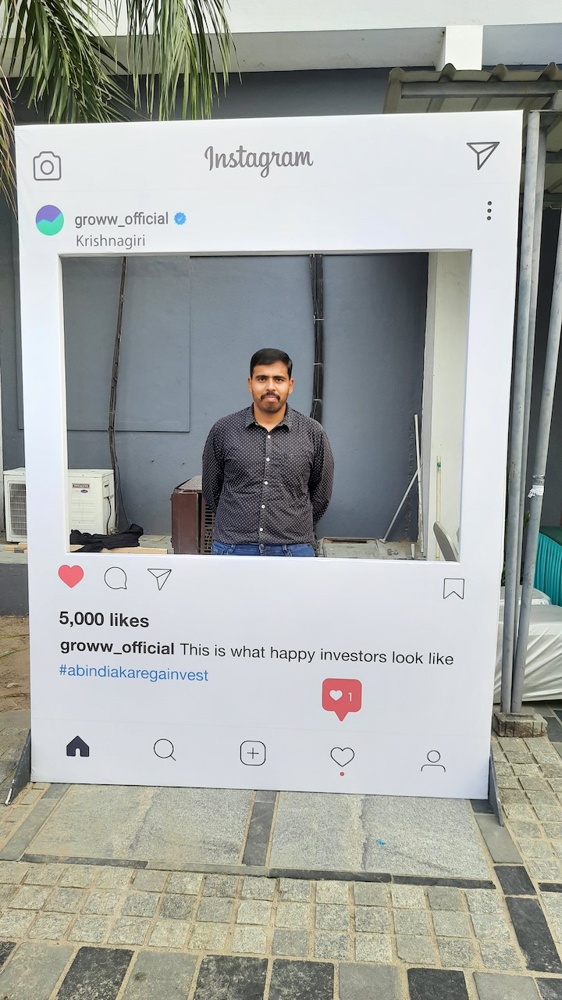
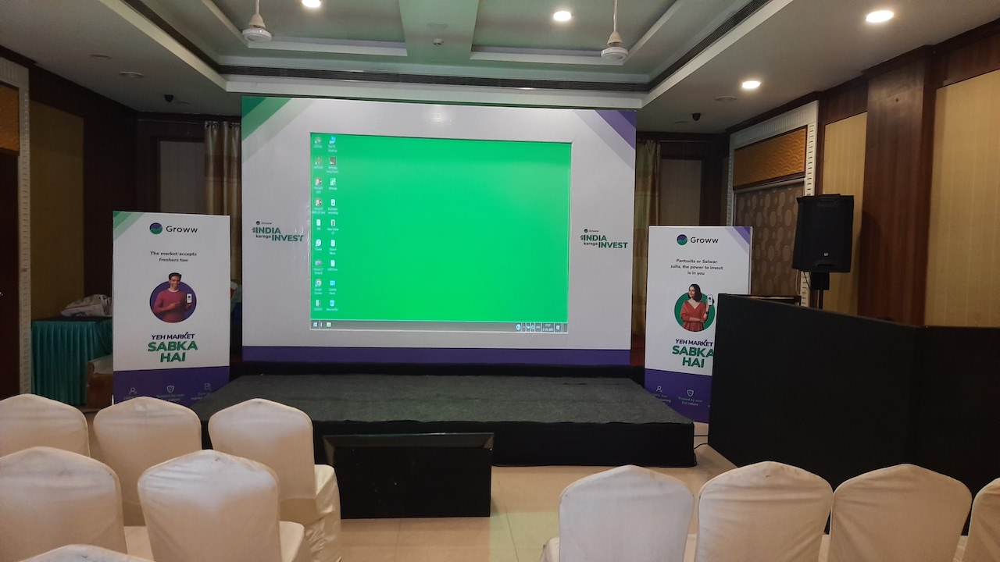

Post covid, I do not attend in person meetings. Hey Covid, you added bunch of excuses to the list. I do not use Groww app however I decided to attend this meeting to hear the financial jargon. This meeting was first of its kind, a meeting about finances is not something that happens often in upcoming cities.

## Venue and arrangements

The venue was in district headquarters or Taluk. The hotel was in a decent location, well-connected to all means of transport. Event had adequate branding arrangements. Not too flashy or the absence of it.

There was a small stage suitable for one speaker to stand and present his contents to a room of 50 to 75 people.

I reached the venue first, and it was an empty room but towards the end, the hall was full.

## Audience

Free tickets were to be booked on eventbrite platform in advance. 

The room had people who where in their teens until retirement. I think the Groww team estimated the audience demographic details by their experience. They had a certified financial planner to give a financial talk for close to 1.5 hours.

## Speaker

His name is Karthik, and he is a CFA. Because that's all we know about him. There was hardly any speaker introduction or hype or welcome address. 

The speaker also did not do PR for Groww. The speaker maintained a neutral view without being sales focused.

## Key takeaways

The general purpose of a speech presented by the CFP would essentially be around having a financial plan in place. The speaker delivered a well crafted speech backed by research and data.

Let me present the unique points apart from stock selection theory, retirement planning, investment choices which were spoken on the stage.

### Comparing similar stocks before buying

Let us assume you are an informed investor. You would select a sector, then industry, and then the stock. But have you compared the stock pick with the peers thoroughly? I do not do that because I know only about company X and not its peers. 

The simplest way to compare would be to use screener website peers table or make your own table with key KPI and access the peers closely. We might pick a better stock in this approach.

> There are 18 sectors listed on NSE.

### Evergreen funds and SIP Millionaires

> The average SIP tenure is about 3 years.

We have seen the fancy Groww SIP calculator throwing 8 figures when you input a decent SIP number and 15 years of tenure but how many really get to realize the numbers? Not many of us, because markets are volatile, scary and nerve wrecking when the corpus gets bigger. 

> In short term the market generates losses but in a period of 10+ years the chances of market investment making losses is very low. 

An average investor tends to take the money out of MF or stop the SIP process. This is preventing people from becoming crorepati. 

The assumption is that you invest your money into flexi cap fund or some evergreen funds which are professionally managed. Mutual funds can be compared to market performance. If the MF is consistently underperformed for multiple years in a row in spite of markets going upwards, then you may have to switch the MF.

> High P/E stocks essentially means that in case of crash, it would take longer time to recover from the crash.

### Approaching investments

The speaker did not say mutual fund sahi hai at all. The speaker was an advocate of tagging an investment to a goal. Tagging investment to a goal relieves the investor from emotional conundrums like should I take my money out or should I worry about the crash, etc.

Let us say you are saving for child college, then the ripe time to think of withdrawing money would be 3 years before college. Withdrawal can be done in SWP.

> As long as the financial goal is met, the investment vehicle hardly matters. 

Investment options should be evaluated in the context of risk and return.

### Trends

Everyone like to be a part of a trend which is bullish, has a long run raking profits for its share holders.

Here are few things we need to be aware of

- Markets follow cycles like accumulation phase, distribution phase, bull phase, bear phase, etc
- Trends arise out of new market opportunities or opportunities in particular sector
- Be good at
  - Identifying trends
  - Taking calculated risk
  - Reading trend lines
  - Trend reversal
- If you can spot trends ahead of one quarter, then you are going to make profit or book profits.

## Summary

> Money decisions should be logical and not emotional.

An evening well spent with good amount of information and surprise goodies which was a T-Shirt.

You can have a good financial future if you have a 

- Steady income
- Wont make big losses
- Save consistently 
- Plan ahead
- Won't make emotional spends.

> Save first, spend next.