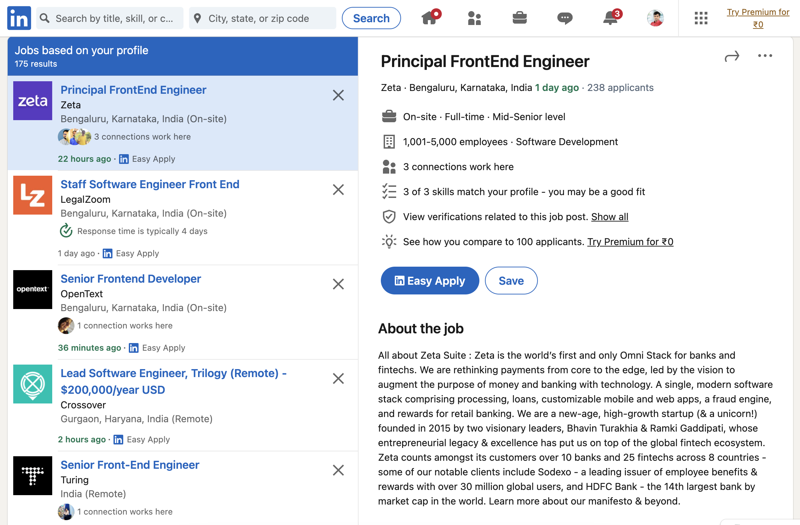

<head>
  <meta charSet="utf-8" />
  <meta property="og:title" content="Insights from Senior Frontend Engineers Job Descriptions - Week 1, 2024" />
  <meta property="og:image" content="/img/2024/week-1-linkedin-jobs.png" />
  <meta property="og:url" content="http://dhbalaji.dev/blog/2024/10-things-principal-frontend-job-boards-W1#9-proficiency-in-frontend-ecosystem" />
  <meta property="og:description" content="Discover the pulse of Bangalore's software development job market for senior frontend engineers with 8+ years of experience through LinkedIn insights. This is first post in the series for week 1 of 2024.  From validating design choices to leading project teams, the top 10 observations unveil the multifaceted skill set required. The blog also explores jargons like Omni Stack, scalable product experiences, hypothesis-building, design thinking, and large-scale frontend applications. Stay ahead with these insights, ensuring your code lasts for years, reflecting the resilience of a seasoned frontend engineer." />
  <meta property="og:type " content="article" />

  <meta name="twitter:title" content="Insights from Senior Frontend Engineers Job Descriptions - Week 1, 2024" />
  <meta name="twitter:image" content="/img/2024/week-1-linkedin-jobs.png" />
  <meta name="twitter:description" content="Discover the pulse of Bangalore's software development job market for senior frontend engineers with 8+ years of experience through LinkedIn insights. This is first post in the series for week 1 of 2024.  From validating design choices to leading project teams, the top 10 observations unveil the multifaceted skill set required. The blog also explores jargons like Omni Stack, scalable product experiences, hypothesis-building, design thinking, and large-scale frontend applications. Stay ahead with these insights, ensuring your code lasts for years, reflecting the resilience of a seasoned frontend engineer." />
</head>

In the dynamic world of software development, staying ahead of the curve is crucial for success. Much like monitoring the stock market for investors, software developers, especially those in senior roles, need to keep a close eye on the job market trends. LinkedIn, being a powerhouse of professional networking and job opportunities, provides valuable insights into the demands and expectations of the industry.

Let's delve into the top 10 insights extracted from the LinkedIn job descriptions for positions labeled as 'senior frontend engineer' and above in the thriving tech hub of `Bangalore`, catering to professionals with 8 or more years of experience.

## 1. Validating Design Choices through Prototyping
Senior frontend engineers are expected to be at the forefront of innovation. Researching and developing proof of concepts to validate design and technology choices ensures that the team adopts the best-fit solutions to tackle challenges efficiently.

## 2. A Multifaceted Skill Set
A strong command over modern frontend development is a prerequisite. This includes expertise in micro frontend architecture, design patterns, version control, enterprise architecture, and software engineering principles. The ideal candidate should be adept at translating initial wireframes into final products, working with any web framework, understanding browser architecture, and handling cross-browser compatibility.

## 3. Code Quality Matters
Demonstrating the ability to write clean, accessible, and responsive code is non-negotiable. An active GitHub portfolio, involvement in side projects, and a commitment to well-tested code are indicators of a senior frontend engineer's proficiency.

## 4. Collaborative Quality Assurance
Working closely with QA engineers is a key responsibility. Providing inputs to test plans, writing end-to-end tests, and ensuring the health of the CI/CD pipeline contribute to the overall product quality.

## 5. Active Participation in Technical Discussions
Active involvement in technical discussions and planning events showcases the candidate's commitment to contributing to the team's success. Full participation in such activities ensures that the knowledge transfer within the team remains robust.

## 6. Leadership Skills
The ability to lead multiple project teams is a distinguishing factor. Managing relationships with both internal and outsourced development partners is crucial for effective collaboration and project success.

## 7. Continuous Learning
The tech landscape evolves rapidly, and senior frontend engineers must keep pace. Continuous learning, both in technical and non-technical domains, is essential for professional growth.

## 8. Code Reviews and Documentation
Leading code reviews and maintaining comprehensive documentation are responsibilities that senior frontend engineers shoulder. Taking on complex bug fixes ensures the longevity and stability of the codebase.

## 9. Proficiency in Frontend Ecosystem
An in-depth understanding of the modern frontend ecosystem, including bundling, linting, testing, and releasing, is vital for seamless development processes.

## 10. Web3 Application Experience
With the rise of blockchain technology, experience in shipping production applications using Web3 libraries, such as Web3.js/Ether.js, is becoming increasingly valuable.

## Jargons Explored

**Omni Stack:** A software-defined platform that integrates storage, computing, and networking resources into a unified system, simplifying data center operations.

**Scalable Product Experiences:** Designing and building products that can adapt and grow gracefully as user base and business needs expand.

**Hypothesis-building:** Formulating educated guesses about user behavior or system performance and designing experiments to test those hypotheses.

**Design Thinking:** A human-centered problem-solving approach in software development that emphasizes understanding user needs, iterative prototyping, and continuous testing.

**Large-scale Frontend Applications:** Complex, dynamic applications serving a vast user base, presenting unique challenges and requiring specific architectural approaches.

In conclusion, senior frontend engineers in Bangalore must embody a diverse skill set, exhibit leadership qualities, and remain adaptable to the ever-evolving tech landscape. By staying informed and embracing new technologies and methodologies, they can navigate the software development job market successfully.