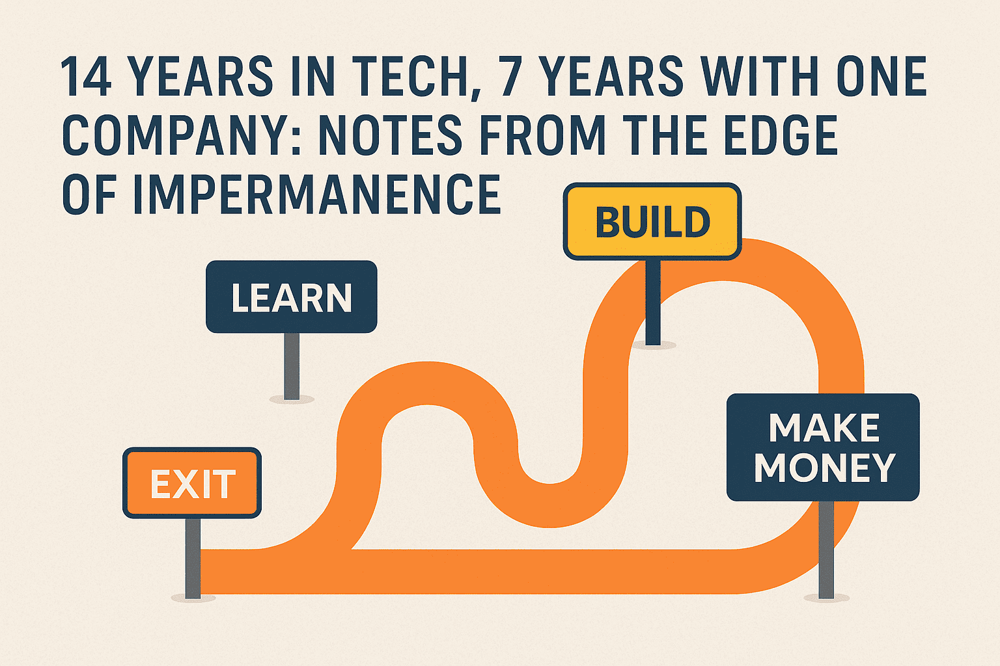

# 14 Years in Tech | 7 Years at One Company | Notes from the Edge of Impermanence

After 14 years in tech — including 7 years at my current company — this isn't a celebration post. It's a reflection.

A career this long doesn’t just give you experience. It gives you patterns. You start noticing what stays, what fades, and what was never real to begin with.

This post isn’t about growth charts, anniversaries, or achievements. It’s a reality check. Especially for those who entered the workforce with dreams shaped by college lectures, parental expectations, or HR onboarding decks.

Bookmark it. Revisit it. Especially when the winds change.

---

## Jobs Are Forever — The Myth We Bought

We were told a job is a destination. Land one, and you’re safe. Study hard, get placed, follow the system, and one day retire in peace.

That illusion didn’t survive its first encounter with real-world volatility. For many of us, it collapsed not in our first job, but in the uncertainty of the second or third, where layoffs weren’t just newspaper headlines — they were personal.

I vividly remember 2012 — hearing the word *layoff* not in a company-wide announcement, but in hushed conversations. Someone had run a SQL script to revoke access for 2,000 employees. That one line of code unraveled years of effort.

Like Abhimanyu in the Mahabharata’s chakra vyuha — we were trained to enter the maze, but never taught how to exit with dignity or direction.

---

## Trainings Will Save You — Another False Promise

Every new tool promises salvation. There's always a 10-hour video, a certification badge, or a learning week calendar invite.

But knowledge ≠ transformation.

You can’t train your way out of stagnation if you never practice. I’ve seen folks with "12 years of experience" who’ve had one year of learning repeated twelve times.

Meanwhile, younger teammates with fewer years and sharper instincts bulldoze ahead because they build, break, and ship things. That edge doesn’t come from upskilling videos — it comes from showing up, making decisions, and seeing them fail or fly.

---

## Hold Virtual Ownership — But Don’t Drown in It

"Take ownership" is on every job description, every OKR sheet, every manager’s feedback form.

But what does that really mean in today’s work culture?

At some point, everyone owns everything and yet nothing gets owned. Developer productivity becomes a sport, but no one knows whether what we’re building even has a real user. Market demand? That’s someone else’s problem. We just sprint.

It’s like rush-hour in a metro coach — packed with urgency, everyone bumping into everyone, nobody willing to slow down or be accommodative.

Virtual ownership without real influence leads to burnout masked as performance.

---

## Your Worth = A Number

Whether you’re a fresher or a CEO, you’re evaluated in metrics:

- CGPA  
- Leetcode score  
- Story points completed  
- Revenue earned  
- Churn reduced  
- Market share gained

If you can’t attach a number to your effort, you're invisible in performance reviews and funding meetings. And worse — you start to doubt your own impact.

It took me years to understand that emotional labour, people management, and long-term design thinking often have a delayed ROI. But you still need to speak in numbers, because the game understands that language.

---

## Layoffs Are Normalised — And That’s Not Going Away

We don’t whisper “layoffs” anymore. We livestream them.

From Elon Musk to startup founders, workforce trims are now strategic moves — not crises. Automation, AI, and economic pressures have made it normal.

- It’s not personal.  
- It’s not fair.  
- It’s just business.

You’re only as safe as your team’s last quarter or your client’s funding cycle. If the macroeconomics are down, even the highest-rated employee gets caught in the tide.

In a way, every job today feels like a stock market investment. You don’t just show up — you bet on the company, the domain, and even the leadership team’s gut feel.

---

## AI: The Elephant in Every Meeting Room

AI is no longer sci-fi. It’s product roadmap material.

But let’s be honest — most teams don’t know how to use it yet. There’s a lot of bravado and very little integration.

I’ve sat in meetings where people say "let's use AI" like it’s a checkbox, not a capability. Truth is, AI right now is where cloud was in 2012 — full of potential, plagued by buzzwords.

I believe by 2030, AI will go through its own reality check. The inflated expectations will burst. Real-world use cases will survive. And people will stop building AI features just to say they’re building AI features.

---

## Deep Open Source Will Struggle

There was a time when being an open-source maintainer was a badge of honour. You gave your weekends to the community. You solved problems no one else could.

Now? AI models scrape your GitHub repo, explain your code, and generate forks without attribution.

The hacker culture that built the internet is now fighting for oxygen. Not because the work isn’t valuable — but because AI is making contributions invisible and commodified.

Governments are already stepping in — from chip bans to AI regulations. Skilled labour, especially in deep tech, will become expensive and geopolitically sensitive.  
Open-source may never die, but without funding, recognition, or viable consulting models, it won’t thrive either.

---

## Final Thought

Work is no longer a straight line. It’s a loop.  
**Learn → Build → Make money → Exit → Repeat**

14 years in tech. 7 years with one company.

This milestone isn’t about loyalty. It’s about adaptability. About understanding the cyclical nature of relevance.

If you’re not changing — the game is.  
If you’re too attached — the system will detach you.  

Because in this game, **impermanence is not a bug — it’s the default setting.**
