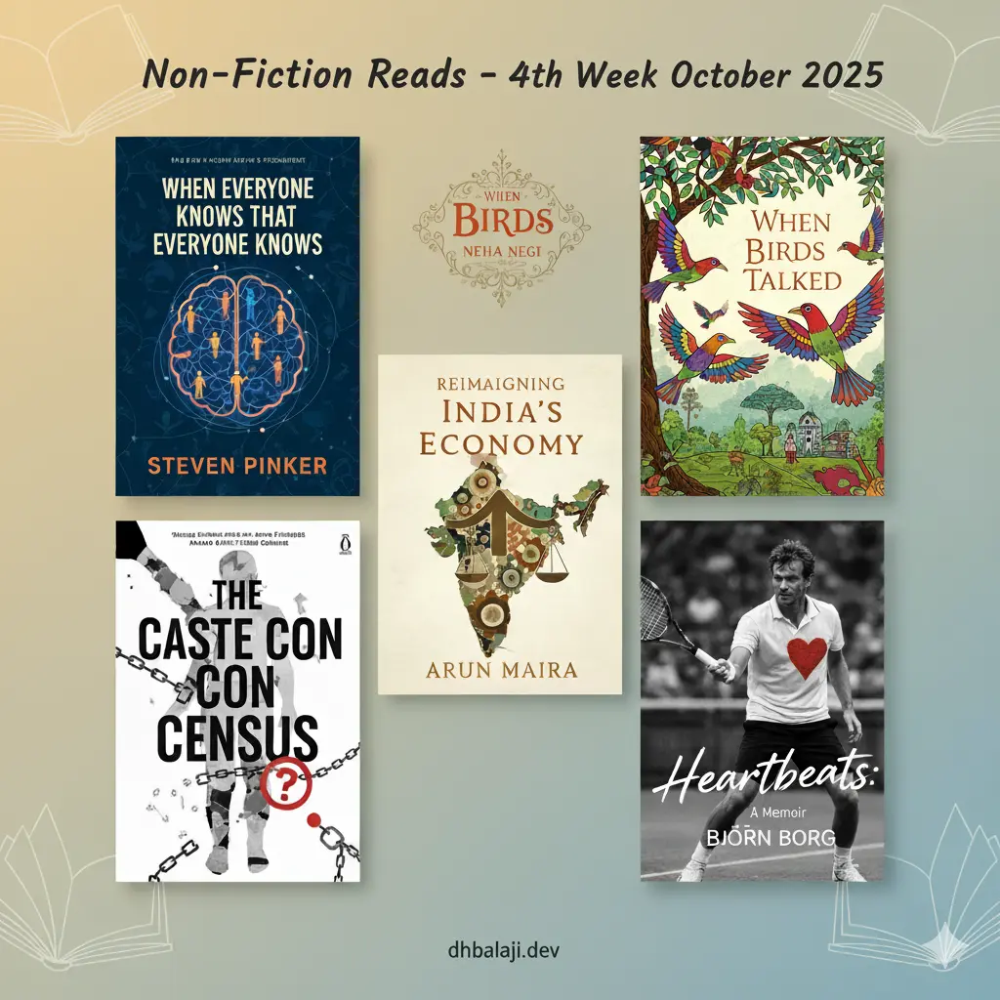

October 2025 has turned out to be an extraordinary month for readers. From deep dives into human cognition to folklore-inspired storytelling and bold rethinks of India’s economy — this lineup reflects what *Your Update Officer* stands for: **curated intelligence that keeps you ahead of the curve.**

Below are five standout titles chosen not for hype, but for the **clarity and curiosity they spark.**

---

## 1. When Everyone Knows That Everyone Knows – *Steven Pinker*

The master of mind and language returns with a study on “common knowledge” — how shared awareness shapes trust, cooperation, and civilization itself. A must-read in an era where everyone *thinks* they know, but few understand what that means.

**Genre:** Cognitive Science, Social Psychology  
**Read if you’re:** A leader, strategist, or simply curious about how collective understanding fuels progress.  
👉 [View on Amazon India](https://www.amazon.in/When-Everyone-Knows-That-Knowledge/dp/1668011573)

---

## 2. When Birds Talked – *Neha Negi*

A lyrical, illustrated collection that revives Himalayan bird myths — stories where nature speaks in metaphors. Rarely does folklore meet such graceful storytelling and visual poetry.

**Genre:** Folklore, Nature, Illustrated Mythology  
**Read if you’re:** A dreamer drawn to stories that connect humanity and nature.  
👉 [View on Amazon India](https://www.amazon.in/When-Birds-Talked-Folklore-Hills/dp/0143476564)

---

## 3. Reimagining India’s Economy – *Arun Maira*

The former Planning Commission member invites readers to challenge GDP obsessions and rediscover inclusive, purpose-driven growth. A timely reflection for those who believe India’s story deserves a more humane script.

**Genre:** Economic Critique, Public Policy  
**Read if you’re:** A policymaker, founder, or citizen invested in the nation’s long-term well-being.  
👉 [View on Amazon India](https://www.amazon.in/Reimagining-Indias-Economy-Equitable-Society/dp/9363360512)

---

## 4. The Caste Con Census – *Anand Teltumbde*

An unflinching critique of the caste census narrative — exploring whether data empowers reform or reinforces division. A sharp, necessary read in India’s evolving social debate.

**Genre:** Sociology, Politics, Indian Society  
**Read if you’re:** A critical thinker who prefers nuance over noise.  
👉 [View on Amazon India](https://www.amazon.in/Caste-Census-Anand-Teltumbde/dp/B0FSF41V2V)

---

## 5. Heartbeats: A Memoir – *Björn Borg*

Beyond the ice-cool legend lies a man wrestling with pressure, fame, and solitude. Borg’s memoir humanizes greatness — a rare confession from tennis’s original enigma.

**Genre:** Sports Memoir  
**Read if you’re:** A sports lover or anyone curious about the cost of chasing perfection.  
👉 [View on Amazon India](https://www.amazon.in/Heartbeats-Memoir-Bj%C3%B6rn-Borg-ebook/dp/B0F6KCH18D)

---

## Closing Note

Every book in this month’s list reflects a **different dimension of intelligence** — analytical, cultural, economic, and emotional. That balance is precisely what *Your Update Officer* curates: not more noise, but the **right updates that move you forward.**

> Next up: *Finance and AI Picks for November 2025.*  
> Stay tuned at [yourupdateofficer.com](https://yourupdateofficer.com)
