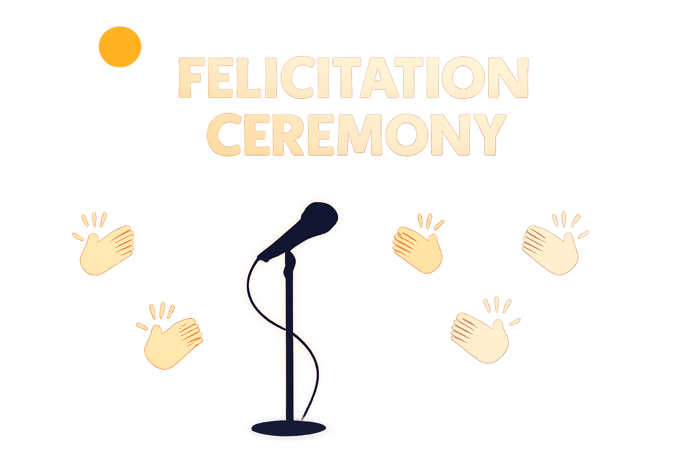

# My Role as Felicitation Chair at the Area D5 Joint Meeting (JTP)

<iframe title="The Art of Felicitation: A Toastmasters Tale" allowtransparency="true" height="300" width="100%" style={{border: "none", minWidth: "min(100%, 430px)",height:"175px", marginBottom: "20px"}} scrolling="no" data-name="pb-iframe-player" src="https://www.podbean.com/player-v2/?from=embed&i=6aki4-193504b-pb&square=1&share=1&download=1&fonts=Arial&skin=1&font-color=auto&rtl=0&logo_link=episode_page&btn-skin=3ab278&size=300" loading="lazy" allowfullscreen=""></iframe>

> *"The best section of Toastmasters sessions? The one where the winners are announced and felicitated."*  
> — Me, after surviving the Felicitation Chair role.

---

## A Meeting of Minds

This wasn’t just another club meeting.

It was a **cross-border alliance of wit, wisdom, and wow-moments** — a **joint meeting of Area A5 clubs**, featuring powerhouses from **Vellore, Hosur**, mind blowing education session speakers and beyond.

And right at the tail end of this prestigious gathering, I was handed a mic and a mission: to felicitate, celebrate, and wrap up sessions like a pro — all in **under 45 seconds per role taker**.

Here’s what the felicitation ceremony looked like:

- 20 people to be felicitated  
- 3 dignitaries on stage  
- Me giving light-hearted appreciation  
- Person comes on stage, collects the gift  
- Photographer gives a thumbs up after the click  
- I call the next person  

Smooth, right? Almost.

---

## My Preparation

The official Toastmasters website had *hardly any information* on the felicitation role.

Later, in a discussion with my **mentee-turned-DTM**, I learned that this role is the **brainchild of the Conference Chair** — someone who truly believes in the “division of labour”... or should I say, *division of roles*.

Though the plan was to have two people share the felicitation duties, the universe decided that one person — me — was a perfect (and only) fit.

Special shoutout to **TM Monica, CA**, whose calm, coaching-style leadership helped me manage the logistics and statistics required to perform this role without chaos.

---

## The Script I Used as Felicitation Chair

### TM-style Opening Hook

> On a Sunday, if I start my bike before 9 AM, it knows exactly where to go — straight to the farmers’ market, where I shop mindfully without worrying about GST.  
> But today isn’t an ordinary Sunday.  
> A Toastmasters conference in my sleepy little town, **Hosur**, with members from **District 120 and beyond** converging at **Advaith School** — now *that* deserves a chapter in history.

For making this happen, everyone in this room deserves to be felicitated.

The felicitation ceremony had **two parts**:  
**Part 1** – Role players  
**Part 2** – Honouring the *crust above the rest*

---

### Part 1 – Felicitating the Role Takers

I invited the following dignitaries to the stage:

- Division A Director **TM Pratheepa Sukumar**  
- Area D5 Director **TM Bharat Nandhagopal**  
- Conference Chair **TM Caroline Padankatti**

Let the show begin:

- *“From gathering registrations on AllEvents to reminding us to carry water bottles, pens, and sharing every crucial detail — welcome on stage, Registration Chair **TM Samuel**!”*

- *“The silent force of Hosur Toastmasters, from co-registration to backend updates — welcome, Co-registration Chair **TM Saravanan**!”*

- *“From informative posters to nostalgic TV-box reels and timely reminders — welcome, PR Chair **TM Vani Ugin**!”*

- *“From backstage coffee to guest care — you were everywhere! Welcome, Hospitality Chair and mighty president of Hosur TM, **TM Gary Michael Henderson**!”*

- *“Your voice carried confidence and set the morning tempo — Emcee Morning, **TM Abidha Shah**!”*

- *“Professional, composed, and to the point — Timer, **TM Priyadharshini**!”*

- *“Post-lunch slump didn’t stand a chance — Emcee Afternoon, **TM Nandini**!”*

- *“Solid stage presence and seamless coordination — **TM Ramesh**!”*

- *“Every great event runs on time, and every second counts — Timer, **TM Saranya**!”*

- *“Delivering precise timing reports — Timer, **TM Abinaya Kannan**!”*

- *“She set the venue, ran behind mics, and now she’s at center stage handing over gifts — our SAA, **TM Monica**!”*

- *And of course, **TM Balaji** – myself, multitasking through all of this with a grin.*

I did go off-script occasionally to inject humor — the energy in the room had started dipping post-lunch, and quite a few attendees had already *vanished* for their afternoon nap.

---

### Part 2 – Felicitating the Bosses of TM

Next, I invited the *District Trio* — a term I learned just a week earlier:

- **District Director, DTM Parthasarathy**  
- **Club Growth Director, DTM Anirudh**  
- **Program Quality Director, TM Vinoth Kumar**

Also invited, in the same sequence:

- **Division A Director, TM Pratheepa Sukumar**  
- **Area D5 Director, TM Bharat Nandhagopal** – effortlessly cool  
- **TM Caroline Padankatti** – the power behind the stage who stayed composed even during 9 PM Google Meet marathons

---

## My Self-Evaluation

I'd rate myself **4 out of 5**.

- I came prepared  
- I added personal flair  
- I adjusted in real time  

One thing I would do differently: I should have **orchestrated stage movements better**, such as having the first set of dignitaries return to their seats before inviting the next batch.

Other than that, the show went smoothly.

---

## What *is* the Felicitation Chair?

- It's the segment where the audience starts **scanning for snacks** (pun intended) 
- Role takers and dignitaries expect a **professional wrap-up**, not a duct-tape script  
- You’ll have **last-minute add-ons** whispered to you in front of 50 people while you’re holding a mic and pretending everything’s under control  
- You must remain **calm, composed, and ready to improvise**  
- Carrying notes isn't optional — it’s a **survival tool**  
- Yes, you do get felicitated in the same ceremony (just don’t expect a standing ovation)

---

## Final Words

If you're ever asked to be the **Felicitation Chair** at your club or area event — don’t hesitate.

Say yes.  
Bring your A-game.  
And remember:

> **Claps fade.  
But well-worded praise? That sticks.**
