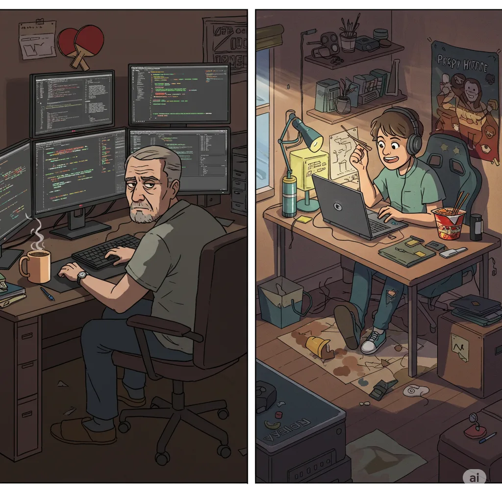

Sometimes you just need to break the writer’s slump, and what better way than to air some tech community laundry/gossips. Here are **3 classic struggles** that keep popping up, no matter how fast the AI world moves.

---

## **1. Senior vs. Junior Conundrum – The Banyan Tree Effect**

Juniors often feel like they’re **growing in the shadow** of their seniors – those **strong, wide-spread banyan trees** that **block opportunities** and stunt their growth. This isn’t just a theory – data shows that **nearly 30% of techies** with **less than 3 years of experience** switch jobs, looking for **more sunlight and fresh air**.

For juniors, the challenge isn’t just the learning curve but **finding their voice** in a team where the seniors have already taken the best seats. It’s like trying to grow a startup in a market dominated by FAANG.

While seniors are busy debating the **best design pattern for a microservice**, juniors are trying to get their **first pull request merged** without being roasted on the code review thread. It’s a constant game of **"How many comments will this PR get before it’s finally approved?"**, **"Will anyone mentor me honestly about all corners of the long career ahead?"**, etc.

Seniors, on the other hand, see juniors as a **potential threat** – the fresh minds who come in armed with **JavaScript, Python, and React** and casually throw around terms like **LLMs**, **prompt engineering**, **hackathons** and **vector databases**. Meanwhile, the seniors are still perfecting the art of **Spring Boot** and **JPA**, occasionally grumbling about how **Java 8** was the last “real” upgrade.

It’s not just about skills – it’s about **mindset**. The seniors have survived **production outages at 3 AM**, managed **political office battles**, and **honestly mentored** a generation of developers who now run startups.

Juniors, on the other hand, are still fresh, living out of **PG rooms**, debugging their code on **15-inch laptops**, and pushing code on a **5G hotspot** while dodging their roommate’s PUBG screams. They may lack experience, but they have the raw **hustle, curiosity, and caffeine tolerance** that seniors often lose along the way.

And if you want a real generational gap, just bring up **Agile vs. Waterfall** in a meeting. The seniors will reminisce about the days when **project plans were thicker than the SRS document**, while the juniors wonder if they should include **Agile Scrum** in their LinkedIn profile.

---

## **2. Employee vs. Management – The Cost-Cutting Showdown**

When it comes to cutting costs, **management** often takes the path of least resistance – **reduce headcount**. Performance, age, location, experience – all fair game when trimming the payroll. This is the **"high-impact, low-cost"** strategy that features in every MBA case study.

From the management perspective, it’s all about **"optimizing the org chart"** and **"maximizing shareholder value"** – fancy phrases that essentially mean **fewer people, more profit**. The logic is simple: cutting the bottom 10% might save the company **millions** without the **PR disaster** of reducing executive perks.

But employees see it differently. To them, the real savings lie in **cutting the fat at the top**. After all, the **CEO earning 100x** the average developer’s salary, **VPs** flying business class, and middle managers enjoying plush perks attending meetings.

And then there’s the **perks debate**. Employees argue that cutting **free food, and fancy offices** in favor of **WFH (Work From Home)** could save millions. After all, those ping-pong tables and **bean bags** aren’t exactly mission-critical. And let’s be real – the only people who truly use the office gym are the same ones who have the time for **marathon LinkedIn posts**.

This is especially stark in India, where **C-level executives** at top tech firms earn **crores per annum**, while a fresh developer might make **7-15 LPA**. The disparity is not just in the paychecks but also in the **power to decide the fate of others**.

---

## **3. The Outsourcing Squeeze – A Tale of Two Realities**

Outsourcing is a simple idea – move work to a cheaper location and **save big**. India, with its massive pool of **highly skilled engineers**, is a top destination for this. In 2024 alone, India’s **IT exports** were estimated at over **\$250 billion**, with **GCCs (Global Capability Centers)** in Bangalore, Hyderabad, and Chennai leading the charge.

But this efficiency comes with a human cost. For every American worker laid off, there’s likely a replacement in Bangalore, Manila, or Chengdu doing the same work at a fraction of the cost. It’s the **"rob Peter to pay Paul"** strategy of the corporate world.

But it’s not a bed of roses for the outsourcers either. They’re often stuck in **corporate jungles** – the GCCs of India – doing the same work for **3x-5x less pay** than their Western counterparts, with fewer perks, **less vacation**, and the constant **contract renewal threats**.

And to add to their woes, the **entry-level salaries** at these GCCs have barely moved in the past **15 years**, despite inflation and the rising cost of living. It’s like getting a **static variable** in a **dynamic world**.

Plus, they have to **sync up at 11 PM** for calls with **PST** time zone clients who think that **IST** stands for **"I’ll Slack Tomorrow."**

---

This post is a simple **rant for the slump** – not to be taken seriously. There are many more battles in tech, like **open source vs. closed source**, **cloud vs. on-prem**, and **Windows vs. Mac**. I’ll tackle those when the next writer’s block hits. 😉

