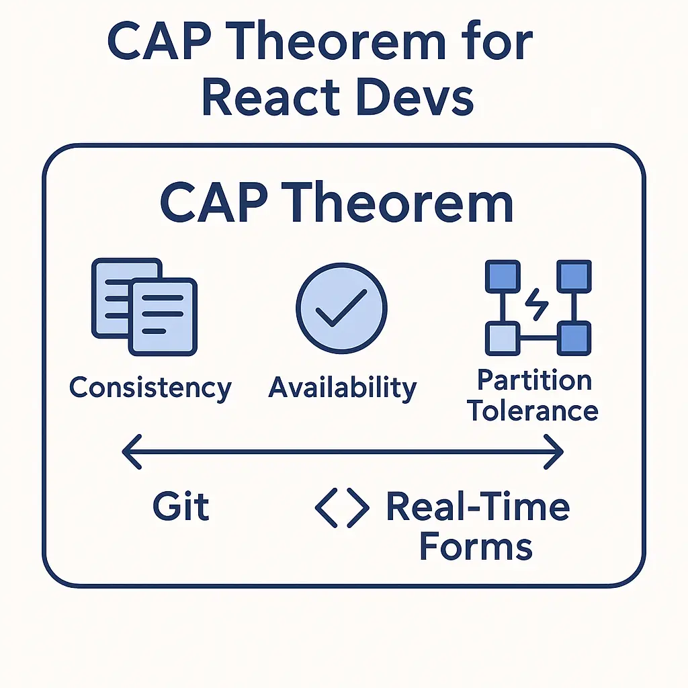

**Why this post?** As frontend engineers, we often focus narrowly on frameworks and tooling—primarily JavaScript, React, and UI libraries. But many of us hit a career plateau because we lack exposure to core software engineering principles.

This post is part of a growing genre I call **“Bridge Posts”**—connecting frontend development to foundational software architecture concepts. The goal is to help frontend engineers think like system designers, not just component builders.

Today, we explore the **CAP Theorem**, a classic principle in distributed systems, and map it to familiar frontend scenarios—such as Git workflows, real-time collaborative UIs, and offline-friendly apps.

---

## Understanding the CAP Theorem

In distributed systems, the **CAP Theorem** states that during a network partition (i.e., some parts of the system can’t communicate), you can only guarantee **two of the following three**:

* **Consistency (C):** All nodes see the same data at the same time.
* **Availability (A):** Every request receives a response—regardless of the freshness of the data.
* **Partition Tolerance (P):** The system continues to operate even when parts of it can’t communicate.

In practice, **partition tolerance** is non-negotiable in any distributed system. Therefore, systems must choose between consistency and availability when partitions occur.

---

## Git Analogy: You Already Use CAP

Let’s start with Git—a tool every developer knows.

* When you commit locally on a plane, you’re in a **partitioned state**.
* You can continue working (**Availability**), even though your code may diverge from your teammate’s (**Consistency** is compromised).
* Once reconnected, you **merge** changes to restore consistency.

**Git is an AP (Available + Partition-Tolerant) system**. It tolerates partitions and lets you work offline but eventually requires reconciliation.

---

## React Use Case: Real-Time Collaborative Forms

Now imagine you’re building a collaborative form in React. Multiple users edit the same form in real-time. Updates are synchronized via WebSockets or polling.

How does CAP play out here?

### 1. **CP – Consistent & Partition-Tolerant**

* If a user loses network connectivity, editing is disabled.
* This ensures everyone always sees the latest state.
* However, the application becomes unavailable for offline or disconnected users.

**Use cases:** Healthcare apps, finance platforms—where data integrity is paramount.

### 2. **AP – Available & Partition-Tolerant**

* Users can continue editing offline.
* Changes are stored locally and synced later.
* This may lead to **conflicting edits**, requiring merge strategies.

**Use cases:** Note-taking apps, chat applications—where user flow matters more than perfect sync.

### 3. **CA – Consistent & Available (No Partition Tolerance)**

* Works as expected under perfect network conditions.
* Any partition causes the system to fail or block.
* While theoretically ideal, **this model is impractical in real-world distributed systems**.

---

### 🌐 Designing for Partition Tolerance

A **network partition** occurs when different components of a distributed system—clients, services, or databases—cannot communicate due to a temporary network failure. Each component may still be operational, but they're isolated like islands without bridges.

In frontend development, this is surprisingly common:

* A user loses internet connectivity mid-session.
* A mobile app hits a dead spot with no signal.
* The frontend can reach a CDN or cache but not the main API server.

**Designing for Partition Tolerance** means your app should continue functioning as gracefully as possible, even during such disconnects.

#### As a React developer, this involves:

* Storing user actions locally (memory, localStorage, IndexedDB).
* Queuing mutations and syncing later (e.g., Service Workers, Apollo cache, Redux middleware).
* Providing clear UI cues: “You’re offline, changes will sync later.”
* Implementing conflict resolution logic, if needed.

Real-world examples:

* **Figma** continues rendering and recording user edits during disconnects.
* **Notion** lets you type offline and syncs the block tree later.
* **Gmail** stores draft emails offline and sends them once reconnected.

These applications **opt for Partition Tolerance**, ensuring the app remains usable—even if consistency is delayed or temporarily broken.

> Designing for Partition Tolerance doesn’t mean ignoring consistency—it means accepting that consistency might be *eventual*, not immediate.

In distributed systems, **network failures are not rare edge cases—they're expected events.** As frontend engineers, acknowledging and designing for them elevates your thinking from component trees to system-level resilience.

---

## Mapping CAP to Frontend Patterns

| Frontend Pattern                              | CAP Tradeoff             | Notes                                             |
| --------------------------------------------- | ------------------------ | ------------------------------------------------- |
| React Query (stale-while-revalidate)          | AP                       | Shows stale cache first, fetches fresh data.      |
| Optimistic UI (e.g., message send)            | AP                       | Assumes success and syncs with the server later.  |
| Disabling forms on lost connection            | CP                       | Prevents stale writes by enforcing consistency.   |
| Service Workers / Offline-First PWA           | AP                       | Operates offline and reconciles post-reconnect.   |
| Live collaboration (e.g., Figma, Google Docs) | AP + conflict resolution | Resolves sync issues with operational transforms. |

---

## What This Means for Frontend Developers

You don’t have to be building a distributed database to care about CAP. If your application:

* **Caches remote data**
* **Lets users work offline**
* **Supports multi-user collaboration**
* **Relies on eventual consistency**

…then you’re actively navigating CAP trade-offs.

Ask yourself:

* Can users work with stale data? → Choose **Availability**.
* Must every write be accurate and conflict-free? → Prioritize **Consistency**.
* Should the app always respond—even during outages? → Design for **Partition Tolerance**.

---

## Closing Thoughts: Frontend as a Distributed System

> **“CAP isn’t just a backend concern—it manifests in every interactive, networked UI you build.”**

Whether you’re building a rich client with React Query, crafting optimistic updates, or designing for offline-first usage, you’re constantly making trade-offs. Understanding CAP helps you make them consciously.

This post was part of a broader mission to elevate frontend engineers into system thinkers—developers who don’t just build buttons, but design resilient user experiences.

Let’s not be cookie-cutter React developers. Let’s bridge the gap.

---

Would you like me to help you turn this into a blog-ready Markdown + SEO-friendly format?
