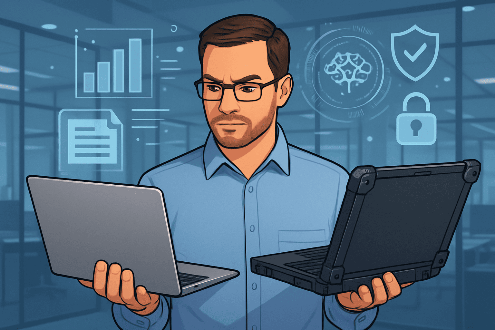

# Consumer vs Business PCs: Why Enterprises Still Pay a Premium

My journey with computers has been… vivid.

- Started with an assembled PC which broke in 2 years
- Tried a netbook which looked like a toy in hindsight, broke in 2 years
- Switched to a refurbished Dell CPU from an unreliable shop which lasted 6 months, abandoned at the repair shop
- Bought a Dell Inspiron (used) which surprisingly served 9 years (10 years total age)
- Worked with at least 10+ managed devices given by employers
- Today
  - running a Dell Precision (11th gen CPU) for coding, content creation and local LLMs
  - running a Dell Inspiron (4th gen CPU) for browsing and on the move
  - M1 mac managed by employer

> TLDR: Consumer printers vs business printers. Consumer cars vs taxis. Consumer PCs vs business PCs. The business-grade version always outlives the shiny consumer one.

Here’s why business PCs dominate both new and used markets.

## Business laptops USP

### 1. Reliability Out of the Box

Consumer laptops are built for light use, good on a store shelf. Stress them and you’ll see broken hinges, dead keyboards, flimsy motherboards, and underpowered chargers.

Business laptops look boring, but they are engineered for 5–7 years of daily grind. Hinges, chargers, and keyboards are higher grade. Battery management is smarter and avoids overcharging when docked all day.

### 2. Trusted Platform Module (TPM)

A dedicated security chip that stores BitLocker keys, passwords, and certificates.

- Provides transparent disk encryption: your PC boots normally, but if the drive is moved to another machine, it’s unreadable.
- Caveat: if the motherboard dies, recovery requires a backup of the bitlocker keys.
- You may need Windows 11 or 10 Pro license to get the most of this feature.

### 3. Intel vPro / AMD PRO

Not just a CPU feature. It enables remote management at the firmware level.

- IT admins can wake, patch, or wipe a laptop remotely—even if powered off.
- This is why enterprises never ship Windows Home on corporate machines.

### 4. Neural Processing Unit (NPU)

The latest upgrade in 2025 laptops (Intel Core Ultra, AMD Ryzen AI, Qualcomm Snapdragon X) also known as AI PCs lineup.

- NPUs accelerate on-device AI such as Teams background blur, Copilot, and real-time translation.
- Offloads work from CPU/GPU and improves battery life.

### 5. ECC RAM (Error-Correcting Code)

Detects and fixes bit flips, crucial for finance, engineering, and scientific workloads.

- Common in workstations such as Dell Precision, Lenovo ThinkPad P-series, and HP ZBook.
- Developers today find 32 GB as a sweet spot. Workstations can scale to 64–128 GB if needed.

### 6. Smart Card Readers and Biometrics

Frequent logins add friction. Business PCs integrate:

- Smart card slots
- Fingerprint sensors
- IR cameras with Windows Hello

Hardware-based authentication is both secure and fast.

### 7. Physical Locks

The Kensington lock slot still exists. Rarely used at home but still standard in ThinkPads, Latitudes, and EliteBooks.

### 8. Workload Testing and Certification

Business lines undergo validation for CAD, video editing, and financial modeling.

- Dell Precision and Lenovo ThinkPad P-series are ISV certified for tools like AutoCAD, SolidWorks, and Adobe Premiere.
- Ensures stability under heat and sustained load.

### 9. Ports That Still Matter

Unlike Macs, business laptops keep Ethernet, HDMI, multiple USB-A, C ports, and docking connectors.

Legacy ports survive because enterprises still run projectors, wired keyboards, and VPN boxes.

### 10. Serviceability and Spares

- Easy to swap RAM, SSD, and batteries.
- Huge second-hand parts market due to enterprise refresh cycles.
- Dell, Lenovo, and HP provide 5+ years of driver and firmware support.

### 11. NVIDIA or Not?

Most business laptops use integrated graphics only.

- If workloads demand it (CAD, AI, 3D design), NVIDIA RTX or A-series workstation GPUs are offered.
- Certified drivers ensure stability, unlike gaming GPUs.

### 12. Conservative Storage Options

Standard configuration is 512 GB NVMe SSD.  
IT-managed fleets prefer predictable configurations and controlled upgrades.

### 13. Thermal Engineering

Fans and vents are designed for cooling, not aesthetics.  
Consumer ultrabooks overheat under load, while business laptops throttle less.

### 14. Displays and Media

Standard = 14-inch, FHD, anti-glare panels.

- Panels are tuned for battery life and productivity, not entertainment.
- Webcam, mic, and speakers are optimized for meetings, not binge-watching.

### 15. Fast Charging Bricks

Business chargers are 90W–130W, larger but faster.  
A quick lunch break can give you 50–60% recharge.

### 16. Wireless Audio Headsets with Mic

Microsoft Teams has revolutionized the market for audio devices. With Teams-certified devices becoming the default, wireless headsets with mics are now standard issue.

- Depend on USB-C charging.
- Last 2 days of moderate meetings and music.

---

## State of Business PCs in 2025

Business laptops have started embracing AI as a first-class feature:

- NPUs are now standard in Intel Core Ultra, AMD Ryzen AI, and Qualcomm Snapdragon X series, powering on-device AI tasks without draining the GPU.
- Windows 11 Pro integrates deeply with hardware security, making TPM and vPro more relevant than ever.
- Enterprise models increasingly offer **Wi-Fi 7** and **5G modules** for field work.
- Battery tech has improved, with some models offering **65Wh–97Wh packs** plus rapid charge, making them all-day machines.
- Docking stations have gone fully USB-C/Thunderbolt, retiring mechanical docks but preserving enterprise workflows.
- Eco-conscious designs are rising: modular parts, recycled materials, and longer official support lifecycles.

---

## Enterprise Hardware Watchlist: August 2025

From an IT admin’s desk, here’s what business owners should track before refreshing their fleets.

### CPU

- **Intel Core Ultra (Meteor Lake / Lunar Lake)**: Common in Dell Latitude, HP EliteBook, Lenovo ThinkPad. Strong balance of efficiency + AI.
- **AMD Ryzen AI 300 series**: Multi-core leaders, shipping with NPUs, used in ThinkPads and HP ProBooks.
- **Qualcomm Snapdragon X**: ARM-based, efficient, integrated 5G, driving Microsoft Surface and select Lenovo/HP.

### Memory

- **16 GB LPDDR5x** is baseline, **32 GB+ DDR5/ECC** in workstations.
- Soldered RAM in ultrabooks, modular SO-DIMMs in workstation-class devices.

### Graphics / GPU

- Integrated (Intel Xe, AMD Radeon, Qualcomm Adreno) good enough for most tasks.
- NVIDIA RTX A-series still essential for CAD, 3D, ML training at the edge.

### NPU

- Intel AI Boost, AMD Ryzen AI, Qualcomm Hexagon: 30–50 TOPS on-device AI.
- By 2025, NPUs are standard across enterprise laptops.

### Display

- 14–15.6 inch FHD+ IPS panels dominate.
- Touchscreen and convertible form factors (HP x360, ThinkPad Yoga) gaining ground.

### Storage

- Default: 256–512 GB PCIe Gen 4 NVMe SSD.
- Workstations: 1–2 TB PCIe Gen 5 SSDs, sometimes with RAID.

### Webcam

- 720p still lingers, but 1080p IR cameras are becoming default in premium models.
- AI-assisted autoframing and background blur now run on NPUs.

### Connectivity

- USB-C/Thunderbolt 4 or 5 for docks, still keeping some USB-A and HDMI.
- Ethernet ports survive in larger T-series/Latitude machines.

### Networking

- **Wi-Fi 7** standard in new 2025 refreshes.
- Optional 5G/LTE modems in rugged and field-oriented models.

### Biometrics

- Fingerprint sensors standard.
- IR cameras with Windows Hello face unlock becoming common.
- Smart card readers still present in compliance-heavy industries.

### Battery

- 50–65 Wh packs for thin-and-light.
- 86–97 Wh for mobile workstations.
- Fast charging (50% in 30 minutes) across Dell, Lenovo, HP.

### Color & Material:

- Business PCs lean towards black, grey, or navy blue matte finishes — less flashy, more professional.
- Materials: magnesium alloy (light + strong), aluminum chassis (premium feel, good thermals), and carbon fiber composites (lightweight + durable for ThinkPads).
- Plastic-only builds are almost gone from premium lines, reserved for entry-level.
- Fingerprint resistance coatings and MIL-STD-810H certifications are selling points for enterprise fleets.

---

## Total Cost of Ownership and Buying Decision

### Why Pay a Premium?

Business PCs almost always come with higher upfront costs, but TCO—the sum of purchase, support, downtime, and productivity—strongly favors business-grade hardware[3][4][10].

- Studies estimate the TCO for a well-managed business laptop to range from $4,600 to $9,793 over three years, with most savings coming from reduced downtime and support costs[4].
- A device with a 1% failure rate versus 5% can save a company over $330,000 annually per 1,000 laptops, primarily through reduced productivity loss and support expenses[4].
- Extended warranty, sled deployment, multi-year OS support, and modular parts drive long-term value.
- IT operations costs (OPEX) and user downtime can exceed capital costs for hardware—lowering failures, easier service, and scalable deployment lead to major ROI[1][3][4].

### How Should Business Owners Decide?

- **Match hardware to intended use:** Office tasks, fieldwork, or production workloads need corresponding device durability and support.
- **Balance upgrade cycles and productivity:** Short cycles add complexity and expense; longer lifecycles (5+ years) minimize disruptions.
- **Consider indirect costs:** Support, downtime, security breaches, compliance, and device failures are more expensive than the purchase price.
- **Plan for the future:** Invest in modular, repairable hardware with warranty and vendor support. Evaluate AI features, but monitor real-world impact before heavy adoption.
- **Engage IT and end-users:** Gather feedback from IT on manageability and from users on workflow bottlenecks.

---

## Final Word

Consumer PCs are designed to look good.  
Business PCs are designed to last, secure, and serve.

If you are a heavy user who hates downtime, a business PC—new or used—is still the smarter investment.
