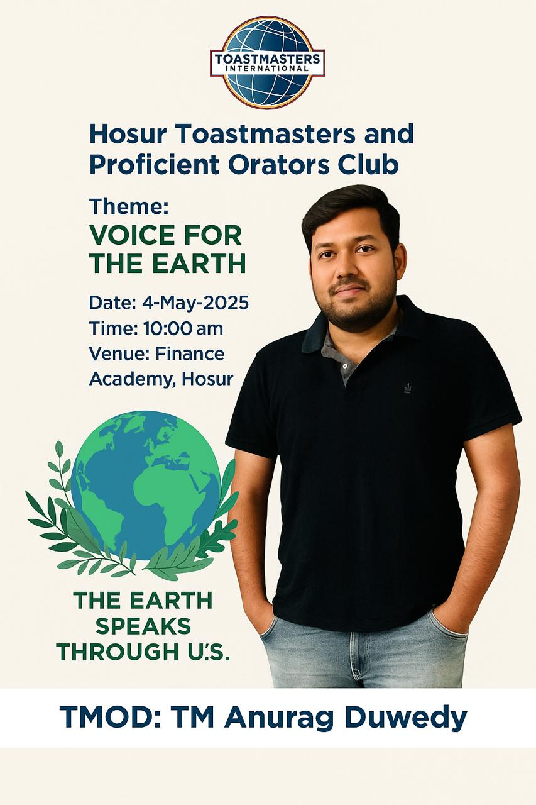

# 🗣️ _Back to the Stage_ — My Comeback to Toastmasters and First Visit to Hosur Toastmasters Club

What happens when a **frontend architect meets a podium** after years? You get a mix of `console.log("confidence")` and some seriously good speeches.

I'm **dhbalaji** — Lead Frontend Engineer by day, Toastmaster since 2012, and collector of certificates like [**CC**, **CL**, and **ACB**](/docs/certifications/toastmasters/acb). After taking a break to focus to master sorcerous Javascript. But when I heard there’s a **Toastmasters Club right here in Hosur**, my curiosity wanted me to do a little mic check.

So I walked in. Here's what happened.

---

## 📍 Where It Happened

- **When:** Every **Sunday**, 10:00 AM – 11:30 AM
- **Where:** 2nd Floor, Finance Academy, **ASTC HUDCO**, Hosur
- **Parking:** Loads of space — park like a boss
- **Setup:** Cosy room with a \~30 person capacity
- **Hybrid Mode:** Online guests can join via Microsoft Teams

🗺️ _If you're Googling "Toastmasters club near me in Hosur" — this is it!_ [Hosur Toastmasters club permalink](https://toastmasters.org/Find-a-Club/07757477-hosur-toastmasters-club)

---

## 👀 First Impressions

Having attended clubs with bells, whistles, and near-TED levels of polish, **Hosur Toastmasters** felt refreshingly raw. Think: garage band with talent, waiting to hit Spotify.

### ✅ What Worked:

- **Diverse Professionals:** Engineers, finance folks, HR pros — all under one roof
- **Mature Audience:** 30s+ crowd added depth and real-life stories
- **Warm Vibes:** Received a formal invite ahead of time (yay structure!)

### ⚠️ What Could Be Better:

- **Sunday morning?** Great for early birds, rough for Netflix-bingers
- **Limited networking:** Hybrid format made hallway chats tough
- **Retention Blues:** Noticed some churn — fresh energy needed

The session I attended was a **joint meeting with Proficient Toastmasters Club**, with quite a few tuning in online. Felt like an office teams meeting — but with better grammar.

---

## 🌟 Meeting Highlights

I won’t pretend I was the General Evaluator, but here’s what stuck with me:

- **Theme:** _“Voices of Nature”_ — poetic, calming, not a weather report
- **Word of the Day:** “**Cacophony**” — ironically, the meeting room fan was anything _but_
- **Prepared Speeches:** Delivered with confidence — definitely mentor material
- **Table Topics:** Real-time adrenaline for guests. I spoke. I survived.
- **TAG Team:** Tracked **Time**, **Ah-counter**, and **Grammar** like ninjas with excel sheets, yes someone ended up sharing screen on teams
- **Evaluations & Awards:** Encouragement with a touch of pageantry and photos
- **Post-Meeting Chats:** Surprisingly rich — could have been better

---

## 🤔 What Could Level-Up the Experience

Here’s my candid guest audit (no PowerPoint, promise):

- Introduce guests early — helps with context and connection
- Bigger in-person crowd = more energy
- Meeting decorum — a little polish goes a long way
- Tighter meeting flow — less lag between segments
- **Record & upload speeches** — boost visibility and speaker growth

---

## 💬 People Who Inspired Me

This was the deal-sealer.

Where else do **frontend developers, sales pros, finance strategists, and HR veterans** talk about communication, confidence, and community — all in the same room?

Special shoutout to **TM Muthu Kalimuthu**, the Club President. His hospitality and thoughtful questions before the meeting made me feel like I was already part of the team.

---

## 🧠 Takeaways from Hosur Toastmasters Club

- Hosur isn’t just about factories anymore. We’ve got **IIT training centres, shopping malls... and now, Toastmasters.**
- The club may not be in full bloom yet, but the seeds are solid. Leadership can make it shine.
- English fluency can be a barrier in this region — **this club is a bridge**, not just a stage.

---

## 👍 Should You Join Hosur Toastmasters?

Yes, yes, a thousand times yes — especially if you:

- Want to improve your **public speaking and leadership skills**
- Are looking for **community engagement in Hosur**
- Enjoy learning from people outside your industry bubble

Here’s how I imagine the club’s golden mix:

- **33%** – Students and early-career folks
- **33%** – Regulars actively participating and giving speeches
- **33%** – Mentors and seasoned Toastmasters offering wisdom from the backbenches

---

## 😆 Fun Goof of the Day

Speaker (with full confidence): “And then I heard the **birds slurping**...” instead of "**birds chirrping**"

Audience: _blink blink_
Grammarian: Noted

---

## 💬 Final Thoughts

I didn’t just walk into a meeting. I walked into **a reboot**.

So if you’re searching for:

- “**Hosur Toastmasters Club timings**”
- “**Toastmasters near ASTC HUDCO**”
- “**How to improve public speaking in Hosur**”

You’ve found your place.

🎤 Come for the speeches. Stay for the people. Rediscover your voice.
