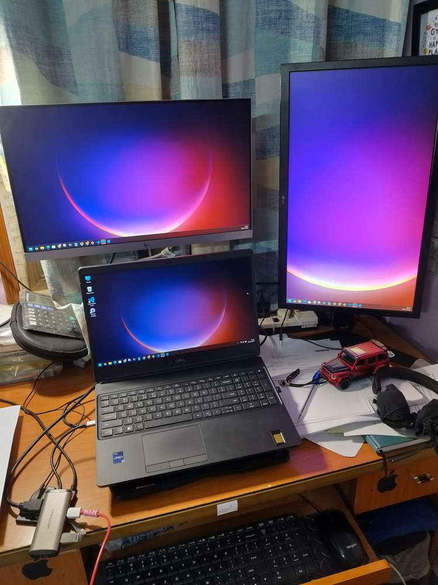

# From Tragedy to Triumph: My Monsoon Laptop Saga

It began as most heartbreaks do, not with a warning, but with a moment. Eight years of companionship, memories etched into plastic keys and flickering screens. This was not just a laptop; it was a cherished confidant, a silent witness to late-night hustles, travels, and the fragile trust between creator and machine.

But even strong bonds can snap. On a monsoon-drenched evening, fate delivered a blow. The Dell service center greeted me somberly, where a sticker cheerily warned about “monsoon laptop care”—advice, in my case, a little too late. The diagnosis: my beloved Dell Inspiron, dead on arrival. There were no heroic rescues, just a silent mourning and the slow ache that follows a familiar loss.

The fallout was immediate. Backlogs grew like weeds. Blogs languished in drafts as an interim Dell Vostro—salvaged from the garage and coaxed to life with Debian—struggled beneath the weight of creative ambition. The void left by the Inspiron haunted every click. Sooner or later, I knew: it was time to let go and move on.

## The Pursuit of Power And Value

I dreamt, briefly, of a desktop—a machine built on ChatGPT-powered advice, futuristic and mighty. But reality grinned: a 3–5 lakh rupee price tag. It felt absurd, the cost outweighing the gains, with the grey cloud of warranty uncertainty looming. Dell’s tower PCs were impossible to “add to cart” without wading through conversations with bots; the tempting A51 desktop was a crush at first sight, quickly doomed by its price—well above ₹5 lakhs.

The configurations under Dell’s “Workstation” banner cost more than a new Ather Pro scooter. Disheartened, I wandered into the wilds of OLX, mentorless but hopeful.

On OLX, the market teemed with budget laptops—plentiful at 25k, but the beasts I needed lurked rarely, cloaked behind search filters: “Dell i7”, “50k and above”. And yet, despite Apple’s siren song and options aplenty, my heart stayed loyal to Dell—perhaps from habit, perhaps nostalgia.

On OLX, two sellers emerged: individuals hoping for a fair price, and seasoned shopkeepers flipping out-of-warranty stock. Caution prevailed; I chose the latter. Stranger meets in unknown places—money flashing on UPI—felt like a recipe for disaster. I wanted reliability, not adventure.

## The Resurrection: Enter Dell 7620

[RG Computer, Belandur](https://www.rgcomputers.in/) was unassuming—a small shop, a friendly shopkeeper, and an attentive assistant. There, among reclaimed silicon, sat my contender: the Dell 7560. (Specs to come.) The inspection ritual began:

- Checked the Dell service tag, verified the model’s lineage.
- Scanned for scars—deep or faint—from previous lives.
- BIOS revealed battery health and year of manufacture (both scrutinized).
- Booted and rebooted, measuring patience.
- Ran HW Info, checked SSD specs—ensuring no deceit hid beneath the surface.

The shopkeeper walked me through their refurbishing process—old NVMe swapped for a fresh NVMe, a subtle upsell attempt gracefully declined. After two hours, I still forgot to check every key, but luck favored me; all were functional.

Armed with a bill and three months of shop-backed warranty, I walked out—lighter in heart, heavier in hand. The workstation is, in a word, solid. I do not recommend carrying it around on your back, its indeed heavy. I use my Dell Vostro for light work on the move.

### Meet the Beast: Dell 7620

- Intel i7, 11th Gen, 8 cores @2.50GHz  
- 32GB DDR4 RAM  
- 512GB healthy NVMe storage  
- Nvidia 6GB graphics  
- Windows 11 Pro  

Things I Don’t Understand Yet

- The 180W charger—why such a power-hungry beast for this machine?  
- The air vents, reminiscent of a car radiator, puzzling me with their design and purpose.  
- The CPU core temperatures, often hovering at 50°C and above—stable or stealth warning?  

Red Flags? Of course:  
- Out of Dell warranty, over four years old  
- Noticeable signs of prior use  
- Fingerprint sensor, more gimmick than guardian  

But for ₹55k? In my urgency, the deal felt fair. Back at the desk, it stood firm—two USB-Cs, two USBs, HDMI, and a DP port. It powers two monitors, a cooling pad, and more. The webcam is decent (bonus: a privacy slider).

## Epilogue: Grief, Growth, Gratitude

Three weeks in, I’m surprised by the stability. I’m building again—products, content, momentum. The wound from the monsoon disaster remains, but it’s fading, replaced by a story of resilience and renewal.

**Overall rating: 4.5/5.** For a refurbished warrior and a rekindled creator’s journey.

