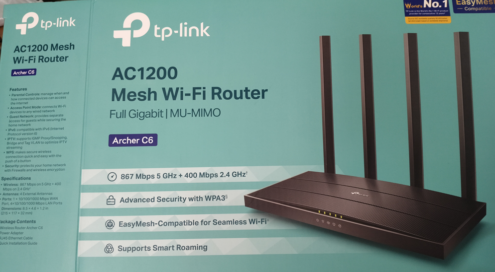

## Quick Recap

We took our first swing at digital hygiene: **NextDNS configured on a non-ISP router, mobile Private DNS set, the whole house subtly steering away from distractions.** Our battle star? The never-ending chase to block YouTube.com for good.

But as always, the story gets more interesting.

## The Parental Control Problem — ISP Routers Just Don’t Cut It

The so-called “parental controls” on most ISP-supplied hardware are a masquerade. The DNS fields are locked down; your hands are tied. For real filtering, the only way out is to move to your own hardware so I picked up a **TP-Link mesh router** supporting true mesh networking.

Mesh brings coverage, flexibility, and—crucially—three distinct SSIDs:
- **Default**
- **Guest**
- **Smart Devices**

Now, with **NextDNS** set at the router level, everything in the house bows to centralized rules.

## NextDNS Profiles: Access Levels Like IAM for Humans

One genius detail about NextDNS is its profile-based filtering, think of it like authorization groups in IAM. Here’s how my rules stack up:

- **Default:** YouTube is blocked everywhere, the good citizens’ network.
- **Elders:** YouTube allowed (but only when the baby’s not around).
- **Dev Mode:** Everything permitted—for me, when it’s time to break things or fix them.

*Side effect:* some analytics break, and anyone with the Tor app can waltz past the controls. It’s not bulletproof, but it’s pretty resilient.

## SaaS Fatigue and the DIY Fix

Here’s the catch: **NextDNS’s free plan caps at 30,000 DNS requests/month**. That’s enough for one or two users, but add a full house and you’ll hit the wall. The fear: getting locked into yet another SaaS subscription for every single filter.

- *Temporary solution:* Careful rationing, multiple profiles, and possibly automating some extra DNS protection. Still, I have DIY plans brewing to avoid lifelong lock-in.

## The Result: Under Control… For Now

With distinct SSIDs, granular DNS filtering, and profile-based controls, the home network feels far more intentional and secure. The only wildcard? Human factors, will elders and guests play along or look for loopholes?

> I personally save nearly 2 hours a day with no youtube, thats 30 days saved per year.

But for now, digital discipline is stronger than ever. Parenthood is chaos; your network doesn’t have to be.

---

*To fellow parents: tweaking your network takes patience, but the peace of mind is worth it. On to the next frontier…*

[1] https://dhbalaji.dev/blog/2025/preparing-home-network-before-first-child