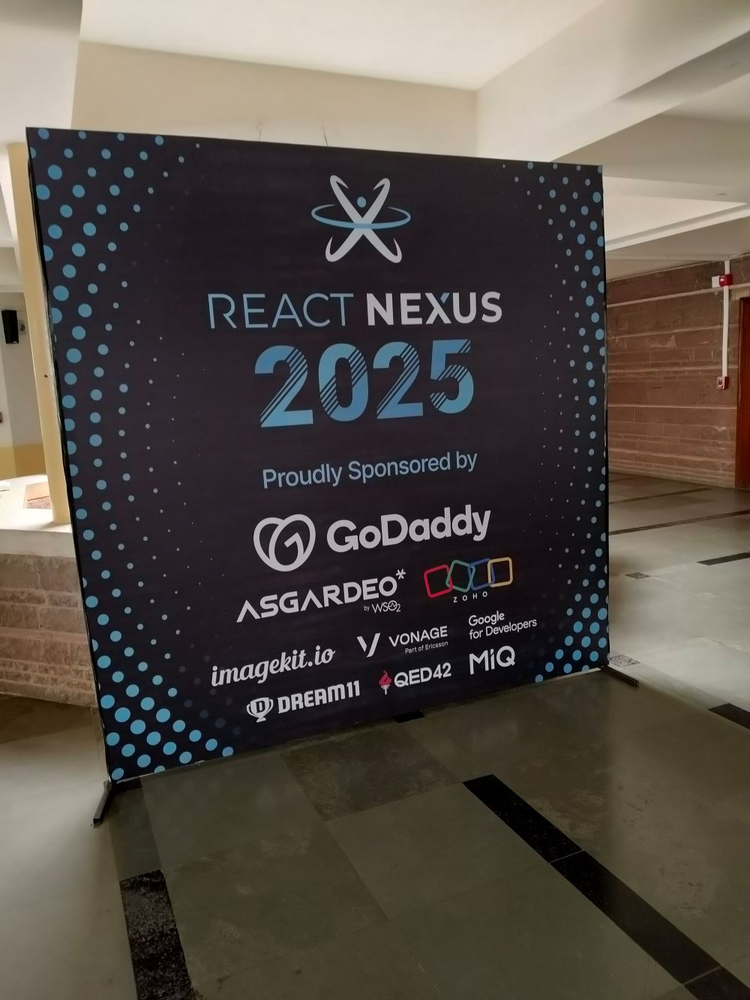
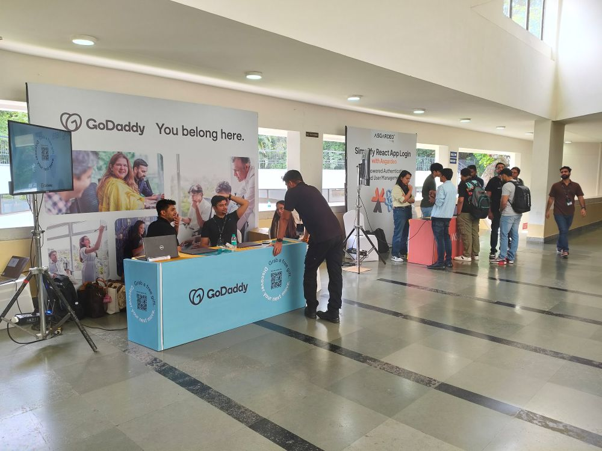
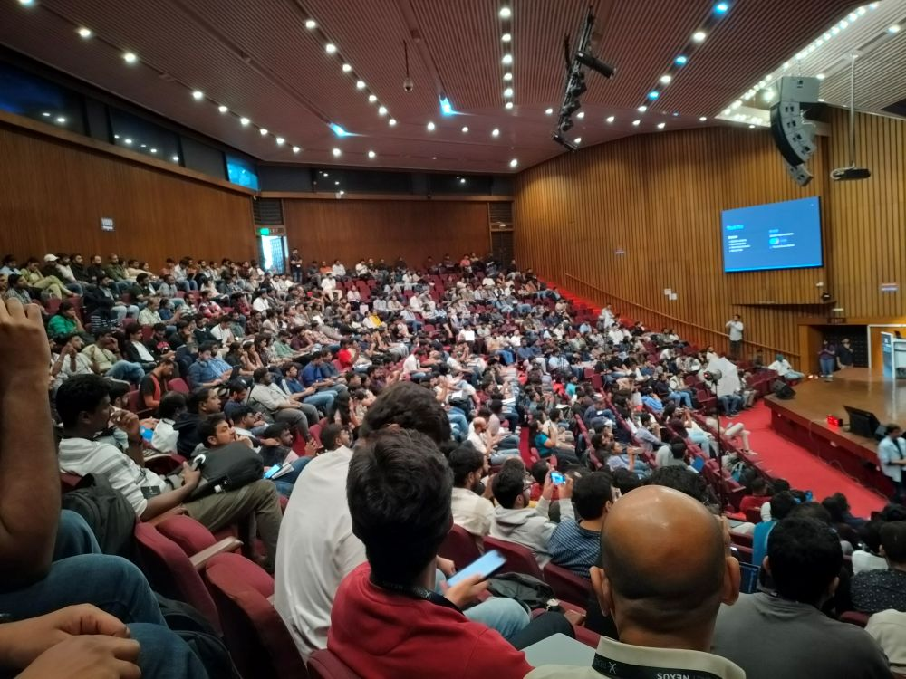

## React Nexus 2025: React Harder

Second time at React Nexus. Bigger venue, bigger sponsors, same old dev jokes. Held at Tata Auditorium, IISC – beautiful place if you like trees and long walks to the nearest metro.

### What Went Down (Other Than My Battery)

* **Logistics**:
  One sticker. One tee. One meal per day. That’s the deal. Cab-friendly, metro-unfriendly.

* **Sponsors**:
  Took the stage like Bollywood villains. Some reruns from 2024. Gemini & Copilot aced the quizzes more than the attendees did.

  

* **ImageKit.io**:
  Indie builder CEO handing out stickers = 🫶
  Who knew images + GenAI + AWS could be a profitable cocktail?

* **GoDaddy**:
  Still selling domains like flash sales. Bought one. Page still says “Hello World.” Now with GenAI, *they* add the hello page for you. Still pushing Outlook 365 like it’s going out of stock.

* **Vonage**:
  Zoom-ish APIs. Most colorful booth. Least understood by crowd. They were hiring.

* **WSO2 Asgardeo**:
  Auth-as-a-service. Repeat speaker, repeat stickers. Still no buy-in from bosses.

* **Zoho Catalyst**:
  “Run everything with us (on free tier).” Indie energy, real. Good for side projects, enterprise signup after sales men raids. Might convert prompt to SaaS if you squint hard enough.

* **Code of Conduct Slide**:
  The usual “don’t harass women” clause. But honestly, dev conferences now look like HR onboarding. 50/50 gender ratio. Welcome change.

* **React 19 + NextJS**:
  Headliners. React Actions API opened the show. Time to un-dust the docs.

* **Audience Engagement**:
  Peak Bangalore moment: guy hacked, built, and launched a product on New Year’s Eve. 🙌

* **React Compiler**:
  Still a mystery box. Used in 3D video gen demo—hit and miss.

* **Best Speaker?**
  Wadad Parker. Tackled React Context with stand-up energy. Put Toastmasters to shame.

* **GoDaddy Talk on Microfrontends**:
  Enlightening. But no tools, just “vibes.”

* **Tech Company vs Software Company vs Vibe-Coded Startup**:

  * Tech company = builds tech
  * Software company = builds from packages
  * Vibe-coded = builds vibes, nothing else

* **Zoho Catalyst (again)**:
  Their domain setup is easier than your weekend plans.

* **Lighthouse Talk (again)**:
  Same speaker. Same slides. Different year. Look at `web.dev` if you need filler content, apparently.

* **Monitoring & Observability**:
  Not the same. One alerts, one explains. Both are friends now.

* **Frontend QA**:
  Smoke tests > Nothing.
  Playwright > Hope.
  Monitoring > Late-night debugging.

* **Telemetry 101**:
  Metrics, logs, traces... add them to your design system if you want to sound senior.

* **AI Tools**:
  Cursor’s @web, @docs, @diff = DevGPT mode unlocked.

* **MCP (Magic Component Platform)**:
  Figma → Code without tears.
  Everyone's happy. Until you self-host it online and leak your keys.

* **React Dev Joke Moment**:
  “Lazy loading is like buying 10 chips, eating one at a time.”
  Me: “Bro that’s throttling. Lazy loading = frequent runs to the shop.”

* **React Native**:
  Few talks. Fewer fans. Still exists.

* **Browser-LLMs**:
  Local LLMs in your browser soon. Because why not.

---

**Conclusion**:
React is evolving, audiences are engaging, and conferences are quietly becoming better. React Nexus 2025 felt more like a community summit than a sponsor expo—despite the sponsor overload. Chennai devs showed up in droves. Peaceful vibes. Good chai. No one shipped to production from the venue, which is a win.

**P.S.** I still haven’t deployed that domain I bought.

