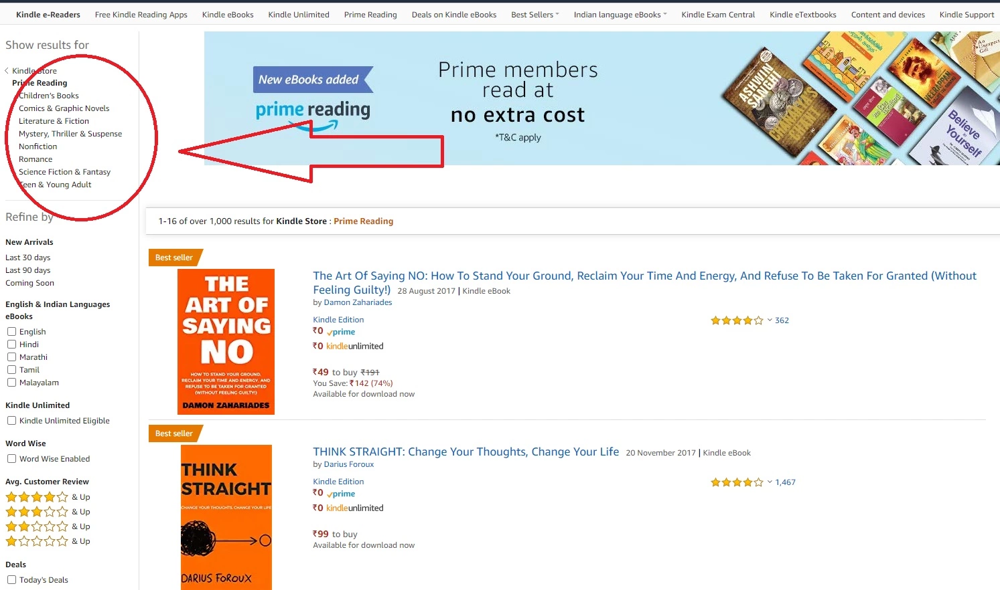
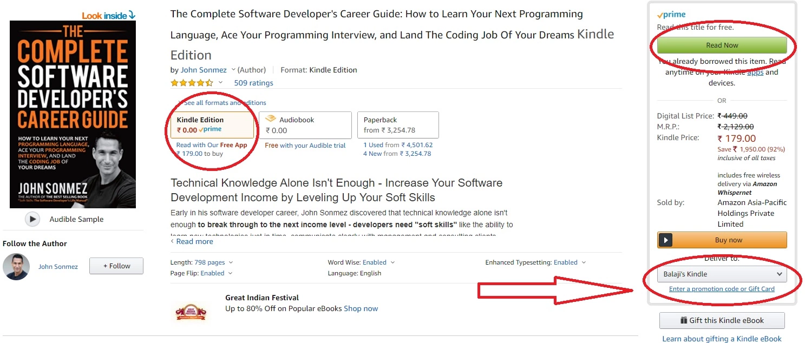
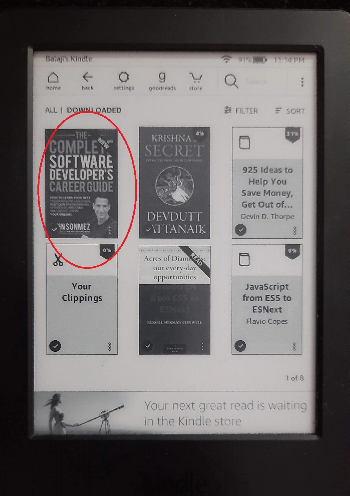

Amazon prime reading is a **book lending library** for Amazon prime users. Damn, I stumbled upon this nice feature quite late.

Hey there, if you have read Russell Conwell's book [Acres of diamonds](https://www.gutenberg.org/files/368/368-h/368-h.htm), you can feel what I am undergoing when I discovered Amazon Prime reading in India. As a bibliophile, I am always on the lookout for books and things around them. I am a proud Kindle owner from 2016 and an amazon prime user for a few years but I did not notice the prime reading feature on amazon.

Amazon prime reading somehow did not fascinate me in the beginning because my kindle was not registered on an Indian address. It was tagged to Amazon USA, so most titles were not accessible even though I was an amazon prime user in India. Since I was not buying any content on Amazon USA, I decided to move my kindle to Amazon India. Looks like a hustle right. Yes, it is. According to Amazon, I moved my kindle from the USA to India. Right now my kindle is perfectly registered on amazon.in. Voila, the prime reading fun begins now.

<!-- truncate  -->

## Here is how you can make use of amazon prime reading

> Prerequisites: Amazon prime account and Kindle device or Kindle app(s) registered on your account

### Step1: Visit amazon prime reading catalog

On the [Home screen of Prime reading](https://www.amazon.in/b/ref=sxts_snpl_2_2_f4f37913-f0a7-4ab2-a028-26103a52959f?node=13678423031&pf_rd_p=f4f37913-f0a7-4ab2-a028-26103a52959f&_encoding=UTF8&pf_rd_r=GAGQW150D0QRPPTZ885R&pd_rd_wg=3ZeKO&pd_rd_w=dIhen&qid=1603731131&pd_rd_r=c0117997-0129-4b07-9244-cc547a81b88b), you will find featured books. These books are priced at 0 Rupees for prime user

### Step 2: Click on any book, or use the links to genre

The featured books were mostly self-help or fiction books like [Vikram & Betaal](https://www.amazon.in/Vikram-Betaal-Illustrated-Maple-Press-ebook/dp/B01JS7JLBY/ref=lp_13678423031_1_6?s=digital-text&ie=UTF8&qid=1603731950&sr=1-6). I decided to explore the favorite genre, the computers bookshelf/link which was under non-fiction.

### Step 3: Pick your book & read for free!!

The genres on prime-reading might be disappointing but there are few good books out there. Stay curious. I searched in the non-fiction genre and here is what I found.

My happiness knew no bounds when I found a book that I wanted to read for a few years. The author "John Sonmez" is famous on the internet with his blog [Simple Programmer](https://simpleprogrammer.com/). His other book [Soft skills the software developer's life manual](https://www.manning.com/books/soft-skills) sits proudly on my bookshelf. It is also my go-to book during stress because it's a life manual for developers. I don't think this blog would have come out if I had not read that book.

The above book in paperback format costs upside of 3000 rupees, now you get it for free. Follow the next step.

### Step 4: Click Read now

This is the last step and you should be good to read on your kindle. Just make sure your kindle is connected to wifi, the sync is almost instantaneous.

If you have not borrowed, you will notice a button `Read for Free`. If you have already borrowed, then you will notice a button `Read Now`. 

### Start reading on kindle

There is nothing that you need to do on kindle, just power on your kindle and you are good to go. I am assuming that your kindle is connected to wifi.

1. Kindle Starts

2. Upon wifi connection, the book has synced in Library > Downloaded books

3. The book information is shown which is the default behavior for any book

4. Meanwhile, on the Kindle apps, I can see a badge on the thumbnail titled `Prime Reading`. Inside I can notice the return book. You can borrow up to 10 books at a time.

## What worked in amazon prime reading

1. I take solace from the `Send to Kindle` feature to read long posts. Amazon's prime reading is as simple as that.

2. The sync is perfect. If you do not have a kindle device, it's perfectly fine. You can use the Kindle apps for mobile/desktop. They would also enable you to read for free.

3. Of course it works offline. No need to be around wifi as usual.

## What did not work in amazon prime reading

Almost everything worked as expected. Here are a few shortcomings or gotchas to remember.

1. The content could be wider & deeper. I meant the books available for borrowing in the non-fiction section. 

2. The content would be available as long as you have a valid subscription. You may return the borrowed book but I do not see any due data.

3. You can borrow up to 10 books at any given point in time according to their terms and conditions. Later you may have to return the borrowed book.

4. You need to be on amazon prime to enjoy prime reading. Prime reading is not sold separately.

## Final thoughts

> When there is no downside to doing something, just do it

It was my self made a quote with some inspiration from elsewhere. I do not see any reason why you should not try prime reading if you are a prime user in India. After all, there is no extra cost. You get free books!!

If you are outside of prime, still there are a lot of free ebooks that are priced at zero rupees which are amazing. You can also sideload books to kindle. Formats like Mobi would work well.

