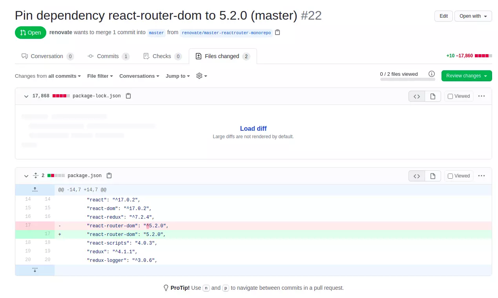

In this how to article, I will be discussing how we can set up a GitHub application to automatically keep our npm packages updated without breaking the app. We will also discuss the shortcomings of this application and if it's the right fit for use in production or in a team environment.

<!-- truncate -->
 
## What is the problem which we are trying to solve?

Let us start with `semantic versioning` of the npm packages. We have 3 segments in the version number which looks like 17.0.2 (which is the react version at the time of writing this blog post).

1. Major version

2. Minor version

3. Patch version

Taking the above version 17.0.2 as an example, we have 17 as major, 0 as minor, and 2 as patch version. Let us say react team releases the next major version, then some APIs might be at risk of not working or deprecated. so the developer reads the changelog and chooses between upgrading or continuing with the same version.

### Problem #1
> In most teams, the npm packages are not updated regularly which puts the application at security risk, and also the team is missing out on the recent developments in the frameworks like bug fixes and performance improvement. This is a type of tech debt that the team needs to pay from time to time.

This problem can be automated. There is a GitHub application for that.

There are other concepts called version drift which is solved by `package-lock.json` which you may read about elsewhere.

### Problem #2

> By default npm will use symbol `^` before the semver version which means that the latest minor change above this semver version will be installed.

The issue is that we cannot be sure which version has been installed unless we dig through package-lock.json which the developer has to upload along with the package.json file.

## Renovate for Automating version updates

The tool/app which solves the problem of npm package updates is called `Renovate` which is backed by a company called white source.

The tool renovate comes in different flavors

- As an npm package called [renovate on npm](https://www.npmjs.com/package/renovate)

- As a [github application](https://github.com/apps/renovate) and as an app on similar git platforms.

- As an on-premise solution which I have not evaluated

### How to renovate works as a GitHub app

We have to follow few steps, and you will be ready to go.

1. We assume you have a repo on GitHub which is old enough and needs npm package updates. I had the react-redux production-ready boilerplate project which is at least 6 months old.

2. Goto renovate app and select the repo to which renovate will have access. you can give access to all the repositories but I do not see any point given the fact that some of them are forks of other projects which I do not intend to maintain.

3. You will receive a welcome PR from renovating with the config file that will be added to your codebase. Merging this PR means you agree to renovate the app to work with your repo. `renovate.json` file will be added to the codebase after this step.

4. After this step, you will start receiving a bunch of PRs to your repo from `renovate`. Most of the PRs are about pinning the semver version to a specific number and avoid the symbol `^`.

5. You can accept or decline the PR. Declining the PR means renovate will no longer work on updating or notifying about the npm package in the future.

6. I also got a PR to fix my node-engine version.

7. You can configure renovate to send you PRs on a specific day and of course, a lot of customization can be done with their configuration changes.

8. You can use their npm global package to validate the configuration file for errors. It's called the `renovate-config-validator` command after you install `renovate` globally.

## Advantages of renovate

I have written about [dependabot](https://dhbalaji.dev/2021/03/14/performance/Dependabot-alerts-on-github-explained/#post) previously. Dependabot takes care of vulnerability fixes to the npm packages. Renovate does something similar to the 
npm packages by keeping them updated in `real time` for free.

The configuration was straightforward forward and I found the bot to be predictable. The npm-based command to validate renovate config file was great. 

The same bot can be used for updated other platform tools like PHP compose, python-pip packages. The bot had been updated by the GitHub actions version too.

## Shortcomings

The configurations were not easy to understand at a glance. To check if the config works we need to wait for some package to be updated and we will get a PR with the new configuration applied.

I am not sure how to configure on my local or CI after going through their docs. Felt like the docs were rushed (like my blog lol).

There was no explanation/justification about the below PR and why it's happening. The logs did not help me understand why this is important.

## Verdict

Overall an easy-to-use bot to keep your npm packages updated. Suitable for GitHub and non-GitHub repositories. Fits the most popular programming lang packages.

