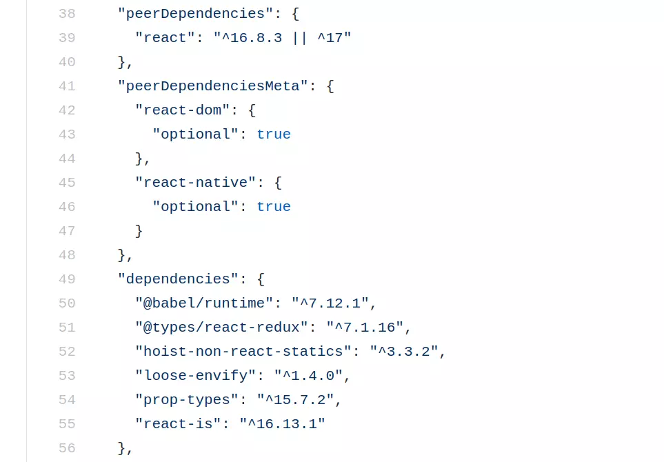

If your NPM package is composed of self Javascript code, then code rewrite or optimization is the way to go. If your npm package is composed of other JS libs which would also be a dependency of the host application, then we have some good news. Have you thought of using peer dependencies?

<!-- truncate -->
 
## Got a package on your mind, want to know its weight?

Try the online tool called bundlophobia. https://bundlephobia.com/package/react-virtualized@9.22.3

## Back to lightweight react npm packages

Before we start building sleek npm packages, let's talk about what contributes to bundle size weight? The answer is the composition of the bundle. A bundle can have something like the moment-time-zone package to achieve something that can be done is 3 lines of JS code. A bundle can be composed of lodash package because we had imported it incorrectly and the tree shaking could not help you.

> The answer to sleek JS bundle is to keep a check on the npm packages that we are imported for use in our code.

The same goes with npm packages, the size is dependent on the composition. Let's take the example of https://bundlephobia.com/package/react-virtualized@9.22.3 . The react-virtualized package is composed of react virtualized code, babel runtime, prop types, dom helpers, etc. If you look at the package.json on their GitHub page at https://github.com/bvaughn/react-virtualized/blob/abe0530a512639c042e74009fbf647abdb52d661/package.json 

The react-virtualized package could have added few more kiloBytes if the author had decided to put react and react-dom in dependencies, instead the author had put their reference under peer-dependencies. 

```json
"peerDependencies": {
    "react": "^15.3.0 || ^16.0.0-alpha || ^17.0.1",
    "react-dom": "^15.3.0 || ^16.0.0-alpha || ^17.0.1"
  }
```

Before we talk about peer dependencies, let's recap the types of dependencies an npm package can have. Some of these dependencies are added to the npm package bundle size.

1. dependencies: when one of the packages under dependencies is missing or not found, the package will not work. Npm install will throw an error.

2. dev-dependencies: during development, a developer might need a transpiler like babel, a bundler, etc. These are not needed in production so the packages used in development are put under dev-dependencies

3. optional-dependencies: sometimes we may code to import a package optionally. By optionally, I mean when package A is not, use the fallback package A1. The npm install won't throw an error if package A was not found.

4. peer-dependencies: when our npm package is a plugin that works on top of some other library, then we can put that library under peer-dependencies.

5. peerDependenciesMeta: similar to peer-dependencies but NPM won't throw a warning when the package is not found in the host. The packages under peer-dependencies-meta are optional. This can further reduce the size of your bundle. For instance, the same package can be used for browser and server environments.

> peer-dependencies are similar to dependencies but they are expected to be provided by the host application. peer-dependencies is a common pattern when developing react plugins.

The npm packages for react projects mostly use react & react-dom as a dependency. The dependencies of the npm package go into the package bundle. To avoid the double copy of react. We can use peer dependencies. This can help prevent duplicate code from going into the final bundle of your react application.

To analyze your react bundles, I recommend the webpack bundle analyzer plugin on your production build.

To sum it up, for react related npm packages. Kindly use peer-dependencies and peer-dependencies-meta to control the bundle size.

```json
"peerDependencies": {
    "react": "^16.8.3 || ^17"
  },
  "peerDependenciesMeta": {
    "react-dom": {
      "optional": true
    },
```

The above JSON is taken from the react-redux package.json file.
