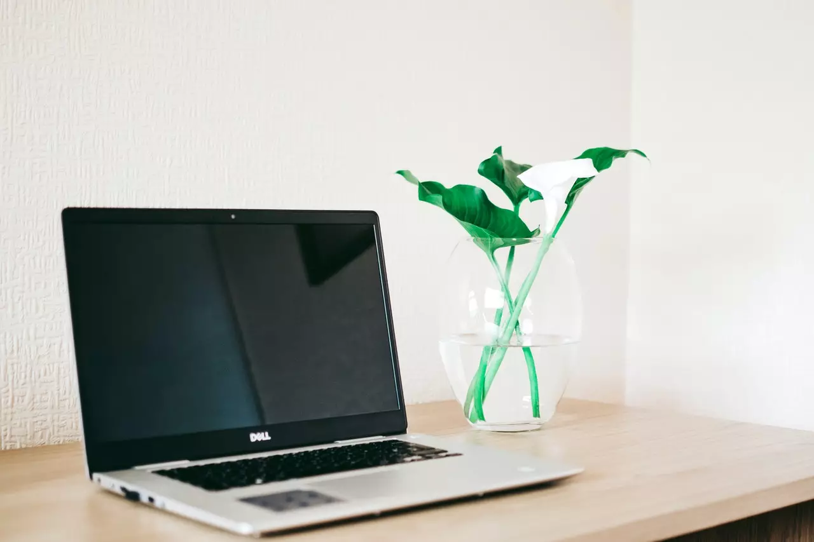

The above picture is not my desk. It could be my future desk. Let's get back to reality. Bad things do happen like PC Operating systems getting cluttered, developing lags, and finally frequent blue screen of death on windows pro on my laptop. It was not an easy decision to move to ubuntu but there is no other way out. Here is why

 
 
## Tell us a little bit about your PC and Ubuntu connection?

I had always been a ubuntu fanboy since 2009. Those were days Ubuntu backer canonical was shipping free CD distro to home free of cost. In 2009 my PC setup was different. I had an assembled desktop that was running Windows XP. I was not sure if it were genuine XP OS or not because it was an assembled PC and as a student, the IT spends have to be low. The XP OS started crashing frequently and I was forced to consider giving ubuntu CDs a try. The timing was right, the broadband penetration at Indian towns made Ubuntu adoption easy. Back then DVD full of software was the norm to distribute software for home PCs. With an ubuntu and 256Kbps broadband connection, I was able to explore new horizons. I was amazed at the simplicity and stability of Ubuntu OS since 9.04. For college projects, I managed with virtual box and windows XP. The setup worked well for at least 5 years.

Then the desktop developed hardware issues and I got it replaced with the preowned laptop on which I am writing this blog. The laptop was once a rockstar in 2015 but in 2021 it's old and got battered with windows 10 pro updates which are quite frequent and bulky these days.

The extra graphic card was the reason why I moved from Ubuntu to Windows 10. I hardly made use of the graphic card, I never played a game on my laptop. The confusion with the scrapping of the virtual box and features like BitLocker made me consider upgrading to windows 10 pro for an extra 10000 INR a few years ago. I used BitLocker all the time but none of the other windows 10 pro features.

Now the frequent blue screen of death followed by 15 minute boot time made me leave windows 10 pro. I flashed windows 10 once thinking the OS was cluttered but after installing basics like antivirus, OS updates, etc the laptop would become too slow. I think the laptop cannot handle the edge anymore, pun intended.

## What was your checklist before installing Ubuntu on your Windows 10 laptop?

Luckily I had the luxury to backup all my data well in time. I use folders with year and month names like `2021.04`, `2020.11` etc to backup my frequently changed folders like documents, etc. The less frequently changed folders like video content are put in a different folder called `cold-line` (a term taken from data storage). The backup of data is the first step before leaving the old OS with data.

1. Backup data on the external hard disk

2. Check if you have backed up password files, ssh, etc

3. Download ISO and flash the ISO to USB.

4. Do a USB boot

misc

1. Check if your peripherals are going to work fine like scanners, etc

2. Decide on absolute minimum software installs on day one. You do not have to install that fancy video editing software etc

## Was installing an ubuntu glitch-free?

Not at all, I did the same mistake which many rookies do. Install every damn software apps that I would use. I wasted the whole weekend only to run into an issue with the Nvidia driver which made me flash the hard disk with a fresh install of Ubuntu.

That was a bummer, now I learned a valuable lesson.

> Install the software on a demand basis, do not install everything at once without restarting your machine in between.

The UEFI firmware has so many settings like confusing app servers. Should I enable secure boot or not? I do not understand how secure boot works yet.

I am an antivirus freak, I did not find any reliable antivirus for Ubuntu yet like my Kaspersky total security on windows 10 pro.

## Did all your peripherals work fine?

Canon flatbed scanner did not work as expected. The apps which I use for scanning look too outdated in terms of richness of features. But I am going to leave it for now until I need all the finer settings.

## Did you copy all the 1.5TB data back to the hard disk?

No, It's like a dump of data including ebooks, audiobooks, video content, photos, etc. I know on which external hard disk it sits so I will copy whenever required. As an IT professional, most of my content is on Gmail & GitHub.

## What happened to your IT spend after you installed ubuntu

The costs should technically come down but I am not concerned about costs at this point. I paid for BitDefender security and it gave me peace of mind that my hard disk content cannot be read. With ubuntu, I know it's secure but I am also afraid of the lack of encryption.

The same with antivirus, I had already spent on a yearly subscription for antivirus, office products and I had to abandon them. I have no plans of installing wine on Ubuntu.

## What were any good moments that you found after moving to Ubuntu

There were quite a good number of improvements like the https://snapcraft.io/ which gave commands for the most frequently used apps.

1. The chrome made most of the sync easy. Just login to your Gmail and your world is back including saved bookmarks and passwords. 

2. The web store app which is my IDE is also available on Linux which made things easy. The settings repo did not work as expected so I had to do some extra configurations.

3. The other apps like VS Code, Calibre, etc are also available on Ubuntu making it a lot easier to continue working.

## Whats your must-have software that you have installed on day one

1. Git

2. NodeJS

3. Discord chat

4. Keepass

5. 7Zip

6. Calibre

7. Webstorm, VS Code

8. Chrome

& OS updates

I did not try installing Nvidia drivers because I won't be using them anyway.

## How is the laptop performing after moving away from windows 10 pro?

I am tempted to run the `top` command to pull in the stats but let me use the system monitor for now. The CPU utilization is fairly low. The keys are responsive. I can see the output immediately. 

Npm installs and other node-related things are quite fast which is making me happy.

The boot time is still unpredictable, but it's on an average of one and half a minute. In windows 10 times it was nearly 15 minutes till everything got responsive to use.

## As your laptop is old, what expenses did you run into?

My laptop had decent insurance cover but most IT repairs occurred after the insurance got expired.

- The keyboard had to be changed because some keys were not working. The new keyboard is not a genuine part so it kind of ruined the premium look of the laptop

- The laptop on/off button developed an issue due to which the laptop won't start at all. After repairs, the button kind of works but the haptic/button feel does not sound right

- The laptop charger and battery were both replaced.

- I am planning to replace the hard disk with SSD in near future.
  
## What is your desk setup like

It's jugaad actually. Nothing purchased with a plan or at once.

- The desk is around 12 years old and has several cosmetic repairs
  
- The office chair is unused and a plastic chair is used in its place. 
  
- The most used peripherals includes Logitech wireless mouse and keyboard
  
- I am equally proud of the tiltable in all directions HP 22 inch extra monitor. I set it to portrait when reading lofty documentation.

- There is a flatbed scanner used sparingly. Its USB powered which reduces the demand for a socket

- There is a fitness band hidden somewhere in the chaos on the desk. I need to find it out.

- The Alexa takes care of automatically turning on and off the light. Sometimes used for light music on Friday evening.

- There is a vehicle refrigerator used as a water chiller near the workplace.

- A 10-inch tab which becomes my permanent tech ebooks reading device

> All the laptops in my home run Ubuntu OS excluding the office laptop.
