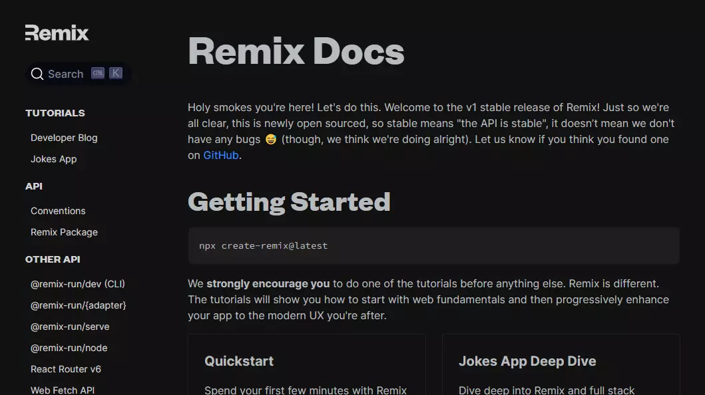

Came across [remix.run](https://remix.run) which is a fullstack typescript based framework. Decided to give it a try. Here is how the day 1 of remix went by. Spoiler alert: It was bumpy.

<!-- truncate -->
 
## What are the cool things about [remix.run](https://remix.run)?

Here are a few selling points or cool things about [remix.run](https://remix.run)

1. Remix is a full stack typescript based framework. No more npm init and installing, configuring, troubleshooting, etc.
2. Remix loves React. No need to learn another new view library.
3. Remix is fast, thanks to caching, nested routes & loaders.
4. React stacks is a great idea and cut down set up issues if everything works normally.

## What were the things that did not go well on DX?

In spite of a great landing page, the code snippets on the site seem to be broken. For instance, the code was written for a older version of remix and the same code snippet would not work with `@latest`. 

The documentation takes you to example apps like `indie stack` or `jokes app` which kind of give an idea about the full stack framework. But again, the code snippets seem to be broken. It made me wonder if the authors would maintain or abandon the project.

## Creating the first hello world with [remix.run](https://remix.run)

This step was simply brilliant, similar to create react app. But the developer has to choose between stack or the basic version. Later, the app is ready with integration, build tasks, etc.

The Code had mix of client and server stuff. In some places the client and server were in the same module. The hello world did not cover anything advanced or highlight the capabilities of full stack, to check them out. The developers are expected to try `jokes app` or `blog tutorial`.

I was interested in `blog tutorial` but the code on the documentation would not work in the IDE. I mean, the code snippets need to be updated.

## Discuss basic folder structure.

The code which was written in the remix scaffold was perfected. Lots to learn and get inspired.

I was working with remix version `1.3.4` and here is how the code was organized. There were 5 folders and 5 files in the root folder.

1. `.cache` - yes the cache folder is used for development but the contents are git-ignored.
2. `app` - contains the code for frontend and backend.
   1. `routes` - doubles down as route on the browser and also API
3. `build` - server side build files are stored in this folder. Contents are git-ignored.
4. `node_modules`
5. `public` - static files related to the client
6. Files
   1. `.eslintrc`
   2. `.gitignore`
   3. `package.json`
   4. `remix.config.js`
   5. `tsconfig.json`

By default, the `.git` repository is not initialized after scaffold.

## React stacks

Thats the topic for tomorrow. As of now, its easy to get confused between which one to learn first. Is it the jokes app or the indie stack. When I was learning, the indie stack code snippet would not work.

## Summary

- Remix is a good idea for fullstack arena
- Remix code snippets wont work out of the box. They are not backward compatible or need to be updated with latest version of remix. This makes me wonder how to update and maintain remix apps.
- For a newbie, asking to choose stacks and others while scaffolding seems to be a ardous task.