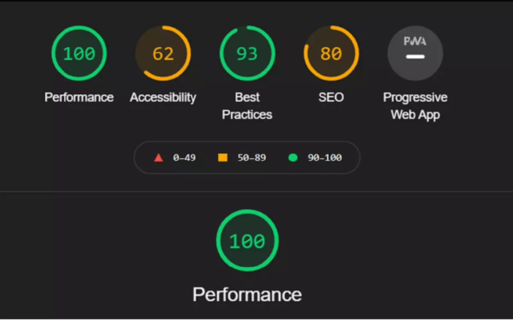

Lighthouse is an amazing audit tool to check the performance of the website based on certain rules. I ran lighthouse from the chrome dev tools and this is what I found. An 80 on SEO score on the landing page. Read this blog to find out how I got the SEO score to 100.

<!-- truncate -->
 
## Why did you prioritize SEO over accessibility?

I understand accessibility is an important metric for both performances and from an ethical standpoint. The blog which you are reading scores 60ish out of 100. Whereas in SEO we were 80ish. From a business perspective, we prioritized SEO over accessibility.

## How did you fix your SEO score to achieve 100 in the lighthouse?

The selection of a library like hexo paid off. We already had an amazing platform that was high scorer on the lighthouse. We had (just) two issues. Here is how we fixed the issues.

### Links not crawlable

Hey, the problem description was "Links not crawlable". It's self-explanatory. The links refer to the `a` or anchor tags on my blog. The anchor tags were not crawlable because they did not have a `href`. The theme developer had used anchor tags for styling purposes.

**Fix:** The fix was to change the anchor tag to a span tag. The CSS got distorted but it was promptly corrected in `stylus lang`.

### Links do not have descriptive text

The problem links to anchor tags. The anchor tags had text which was not descriptive. When I checked the markup, the text was _"Read more"_. I felt that was descriptive but according to lighthouse terms like here, click here, etc are considered non-descriptive.

I changed the text to "Continue reading". That fixed the problem.

The SEO score raised to 100%.

## How to run the lighthouse

Though it's easy to run from the very tab where you are browsing, I do not recommend this approach as there are chrome extensions also working with the DOM.

I prefer opening chrome in guest mode or incognito and run the lighthouse audit on the production build.

You can create a production build on the local and run `serve`.

## What's next on the SEO front

There are a lot of areas of improvement.

1. The blog has multiple pages which need to be checked. Right now the audit has run on the home page only.

2. We are experimenting with tools like Screaming frog SEO spider. More information about this tool coming later.

## Summary

- Lighthouse is an amazing audit tool

- Follow the lighthouse recommendation to get the score to 100

- Sometimes code stuck within EDL or design language is hard to modify. It can impact your SEO score.
