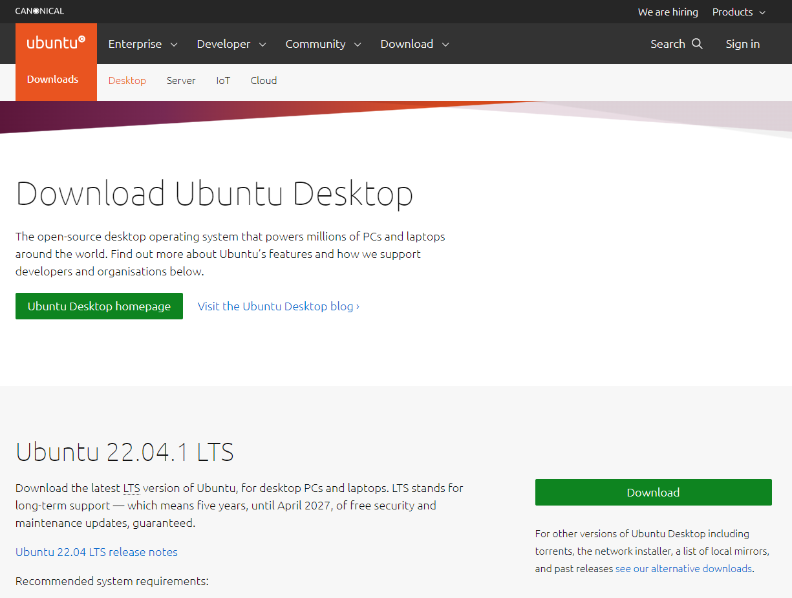

Installing Ubuntu Desktop is a job with no frills but you do not install Ubuntu quite often so its natural to forget a few things so here are the 10 steps which I followed while installing Ubuntu desktop in 2022.

1. Download Ubuntu Desktop and Burn it to an USB through a tool called [Ryfus](https://rufus.ie/en/)

2. Google for the key combination which would invoke laptop boot from USB. This would save time.

3. Choose between options available for installing Ubuntu. This step is irreversible so be cautious. I choose to have dual boot with windows OS. Skip wifi setup while installing OS. I find this step to slowdown installation of OS.

4. Choose a username and password. Make sure you do not forget it. Sometimes in an dual boot setup, you may not use the OS for months.

5. Once the installation is complete, setup wifi. Once connected, run `sudo apt update`.

6. Install VS Code, node, postman from Snap store

7. Install git from apt package manager

8. Set up SSH for github and set config email, user name etc.

9. Install extra packages to handle `.rar` and other file formats

10. Install Synaptic package manager and remove unwanted bloatware games.