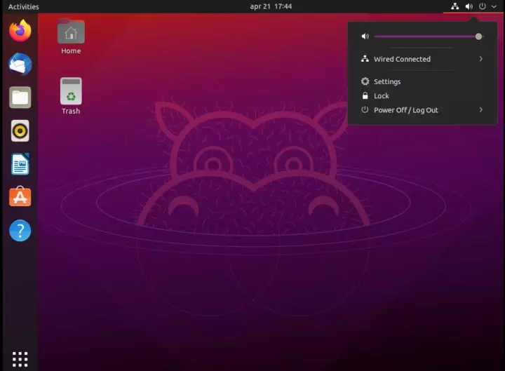

Historically the OS running on my workstation was not mainstream. Ubuntu desktop was eccentric, esoteric, and uniquely customized to my needs. Ubuntu remains a solid OS for personal needs but not fully loaded for all my tasks. Let me show you where ubuntu-desktop shines and fades in 2021.

<!-- truncate -->
 
## Why I considered Ubuntu?

my first encounter with ubuntu-desktop was in 2009. Back in the day, Ubuntu parent company would ship compact discs home for every minor release. That's so nice of them in the era where some countries were still using 2G and had scanty broadband penetration.

In 2021, the reasons for considering Ubuntu are the same.

1. Ubuntu is tried and tested
2. Ubuntu desktop is free to use. I do not have to read and compare versions.
3. Ubuntu commands, package managers are familiar to me. As a web application developer.

## Areas where Ubuntu desktop shines in 2021

The costs associated with the hardware and software come down substantially. In India, if I need to run windows pro, you need to shell out 12.5k INR, and to run windows you need good RAM and I recommend 16GB because we all use chrome browsers.

Ubuntu is all you need for coding, running servers, and working with NodeJS. Ubuntu suits the best for web developers who code all the time. Working with the Ubuntu terminal is a delight. It's such a nice responsive shell.

Normal tasks like browsing are delightful on Ubuntu, the chrome browser from Google works great on Ubuntu without bugs. The other tools like libre office, web storm, and Typora are available on Ubuntu. I can live with Ubuntu as a developer.

Snap package manager is a delight to use on Ubuntu.

## Areas where Ubuntu desktop OS fades off

The cost savings are not substantial. As an intermediate-level developer, I took more than double the time when I am setting up some like the video editing workflow. I had no success in setting up the video editing workflow because Ubuntu and Nvidia graphic cards simply won't get along. If time is as precious as money, then I was losing a lot of time with Ubuntu. Boot time is quick but interaction with apps was time-consuming. Find a watermark option in LibreOffice, you will understand my pain.

> I missed out on publishing videos on Youtube after moving to Ubuntu. It's a gap and it's compelling to fill it.

The apps in Ubuntu were dull and looked like built-in 2010. The GUI on most apps was simply not modernized. I understand that Ubuntu geeks love the command line but some menu items and options inappropriate places won't hurt. Adding to the woes is ubuntu software which is like a Microsoft store but ubuntu software hardly works.

The hardware of my workstation and setup won't work properly with Ubuntu. The dual-monitor worked great. The flatbed scanner just won't work out of the box and another 10 to 15 minutes setup every time I try to use it. The alternate is to use a virtual box with windows running on Ubuntu. I would scan from the virtual box OS. This move contradicts the cost savings which we anticipated.

zoom client is not polished like its windows client. I had to settle with the browser client and there is no record on Ubuntu for zoom. This is the case with some apps where some features are missing in ubuntu.

Security on Ubuntu was a deal-breaker for me. There is no reliable IT security software I can use for scanning and protecting me against threats. Some people say we do not need IT security software on Ubuntu but I differ. When you are troubleshooting some issue, you end up executing commands taken from the internet. Hardware encryption exists in Ubuntu but somehow it's not elegant as BitLocker in windows 10 pro.

## Switching OS and how it feels

If you have not installed OS in the last 10 years like most of my friends ever since the office IT team started taking care of their laptops, then be ready for the surprise. You need tools like Rufus to burn ISO to USB in a format that's understandable by UEFI firmware. The first step would be to identify if your laptop is using legacy or bios or UEFI firmware.

It's not hard as it used to be. Once you install Chrome and log in, you get your life online as you used to earlier. I like that.

Of course, I need to install some software, set up ssh, install NodeJS. The backed-up data need to be copied back. It almost takes 10 plus hours to copy the data.

> If you remember your workflows vividly then setting up things would be easy. You would know the tools and files you would be working with.

## Verdict

Moving to Windows 10 frees me from remembering extra commands and keyboard shortcuts. However, there are other laptops in my home running on Ubuntu because Ubuntu is simply great for the simple use case and it justifies the costs.
