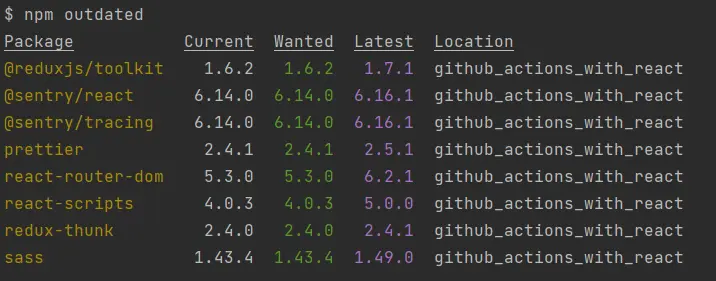

As a senior developer or an architect, one of the job demands would be to update the `npm-packages` of your application. Ironically there is no one single command which would start the update and end the update with all finesse and grace the application would need. here are a few lessons from my job on updating npm packages.

 
 
## What are `npm-packages`?

The javascript code is organized into modules. The modules can be reused, across the org or the community. Then with the birth of npm and GitHub. the open-source synergies got together. we got focussed, functional and well-engineered Javascript modules packaged as npm packages.

the package is slightly different from a module. The npm package has a couple of obligatory files like `package.json`, sticks to a particular format like common, etc.

The npm package has a bunch of identifiers

1. a unique name
2. a version number
3. a sha id associated with the release

Each of the above identifiers serves a purpose. The unique name is for identifying the package among the crowd of packages. The version number aka `semver` number is for release management. The sha id ensures the integrity of the bundle and ensures it's not tampered with malicious intent.

## Best practices while working with dependent npm-packages

> Updates are easy but upgrades are risky. But even a simple npm install could break the application when one dependency pulls the package out of the npm or a corrupt version takes the seat.

- We need to appreciate what the tools like `npm` already give us. Things like 
  - `^` for compatible changes only, suites well-established packages which pass through alpha, beta, and RC
  - `~` for close-to changes only, suites for semi-popular packages
  - defined version for a package you found with little to low activity and maintained by solo developers. The chances of the solo developer making a breaking change are high due to a lack of review.
  - `*` do not use it
  > `npm i` and we need to check and assign `^ ~` or the absence of the prefixes.
- The semver numbers need to be taken with a pinch of salt. They are a guideline but nothing stops the developer from accidentally pushing a change that breaks the contract established by the previous version.
- Updates not performed over time are a `tech debt`. Not every team or product has the luxury to be debt-free. It is okay to live with debt unless the team is excited to be cutting edge (which happens all the time, it is hard to hire good talent for old tech) or the business is losing something significant.
- Before updating npm packages, I would look at 2 important pieces of the problem.
  - application performance & integrity
  - developer experience
  > I would not shake up dependencies and dev dependencies on the same day.
- CI or continuous integration should check if the app dependencies are available (on a new network) and the app can start once the code leaves the developer machine.
- When the package has a version like `^16.1.0`, and you do `npm i` you may get `16.8.0` installed. That is risky because we invited 7 minor changes to API in our code base. In this case, it's better to stick with a defined version.

## Npm update on the command line

- Run `npm outdated`, pick the number you want to upgrade or update to.
- Pick one package at a time unless the use case like babel upgrade demands multi-package updates at the same time
- update the number on package JSON (defined version instead of `^`)
- Run the application, check if the scope, test cases, and other CI passes through.

Other tools like `npm-check-update` or `renovate` speed up the risky process. Updating packages is best when done slowly with some operating procedures. I have broken my blog many times because of speedy npm-package upgrades/updates.

> Keep the update activity known only to your local machine. You have a lot of time to investigate if things go bad. Downtime of dev or Jenkins build would raise a flag in some dev teams.