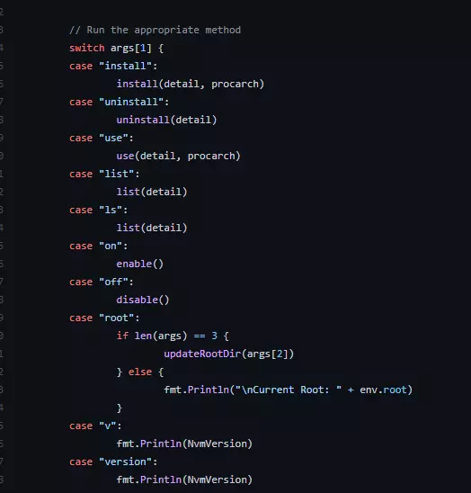

Globalization is essentially trying to emulate what worked in country A in another country. Similarly, nvm-windows is an attempt to bring the goodness of the popular node version manager (nvm) to the windows operating system. Let us find out what nvm-windows attempts to solve and how it works.

 
 
## Why node version manager?

When we have an infant at home, we give the infant different food from what the elders eat. Similarly not all nodeJS codebases are equal. Some are old and need different nodeJS versions which may not be present on your system. A beginner nodeJS developer may work with one version of NodeJS but when you have to work with legacy codebases, then working with different nodeJS versions is an unavoidable step.

Visit this amazing website called [node.green](https://node.green/) to find out the nodeJS support.


## What is nvm-windows

At the core, nvm-windows is an npm package that helps you run different node versions on your operating system. If you have to do without nvm-windows, then you have to 

1. uninstall existing node versions from your operating system.
2. download the exact version of nodeJS from the nodeJS website
3. install the nodeJS version on your machine.

These steps are laborious and time-consuming. That's where nvm-windows come into the picture.

## How does nvm-windows work?

nvm-windows has an important pre-requisite, you need to uninstall any existing node JS versions.

nvm-windows is going to dynamically modify the contents of the node JS folder on your computer every time you run a command.

``` bash
nvm use v12.12.0 64
```

The above command is going to 

1. remove the contents of nodeJS folder from program-files on the windows machine
2. download the exact version of nodeJS mentioned on the machine. If it were already downloaded, then this step will be skipped.
3. the downloaded version of node JS will be updated in the operating system.

when you run `node --version` then you will be seeing the updated version in your cmd.exe.


## architecture of nvm-windows

Understanding nvm-windows code is hard because it is coded in the `go` language. We can start with the `nvm.go` module and you will see the main function.




the functions are clean and modular. Operating system concepts like signals and symlinks are used. Technically the program files contents are not changed. The environment variable path gets changed to the downloaded and unzipped location. 

## APIs of nvm-windows

The nvm-windows are not something you would import as a package. Rather it's used at shell scripts to control the node version that's used for the development or deployment.

After installing nvm, we need to turn on the nvm-windows by `nvm on` and similarly turn off with `nvm off`. I have personally not used `nvm off` till now because my machine would lose nodeJS if I do so.

We need to mention the valid semver version in command for nvm to download the package along with the architecture of the CPU. Simply 32/64 bit. 

`nvm install v12.12.0 64`

Once downloaded, we need to ask nvm-windows to use the version of node JS that's available. Using `nvm list` you can see the available versions that can be used.

`nvm use v12.12.0`

Then check the node version with `node --version`

## Downsides of nvm-windows

In development teams, it may happen that few team members are not on the mainstream operating system. But as an architect of the product, we need to bring them to the same level in terms of local dependencies and setup. This can be achieved by configuration files. With node version manager we get `.nvmrc` which contains the version of node to be installed for the repository. But nvm-windows won't understand `.nvmrc` so we need to keep the version updated in the readme file.

Similar the nvm is smarter in terms of fetching node versions. `nvm use v12` would fetch the latest version on Mac/Linux but on windows it expects the developer to find the exact semver number and provide it in the command.

## About the developer of nvm-windows

The author is Corey Butler who has built amazing oper source products. I am impressed with his meetup called [Bleeding edge](https://www.edgeatx.org/slides/) which happens on the fourth Wednesday every month.

The documentation on nvm-windows is professional including the production-level scenarios.

## References

https://github.com/coreybutler/node-windows
