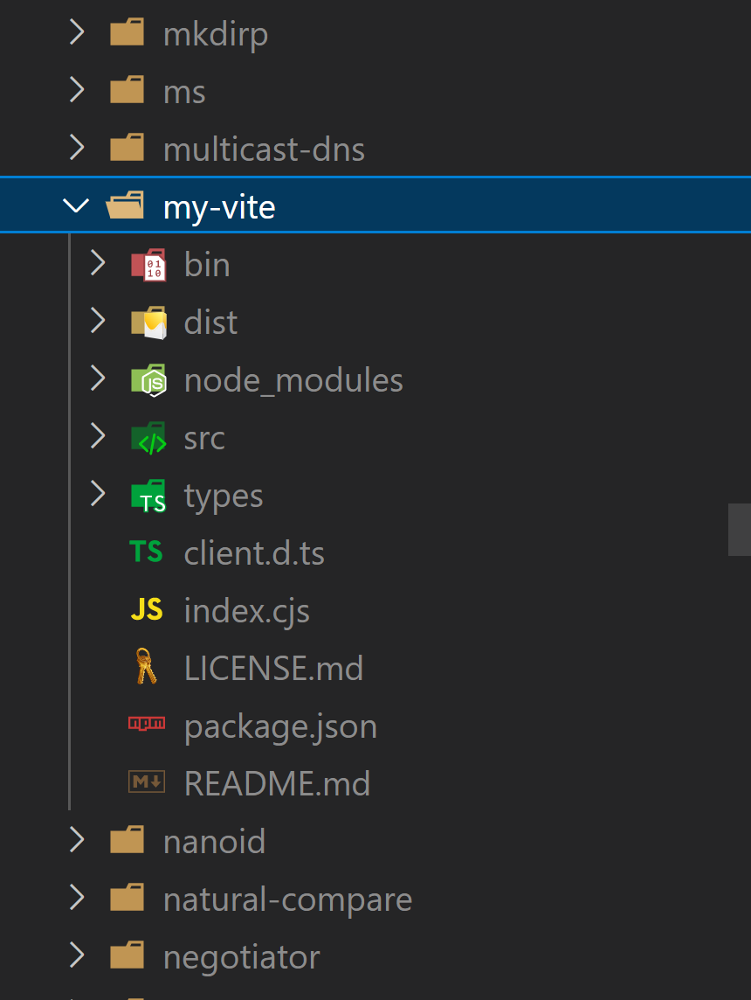

From the title it sounds like a lot of cool technologies working side by side isn't it. Let me list them once again

- Turborepo - managing monorepo
- NPM - package manager
- NPM workspaces - also provided by npm, assists in monorepo
- vite - frontend tooling, rollup wrapper
- vite react - template for vite


## Use case scenario

I have a cool `monorepo` on github which holds all my sample projects, experimental works and code sample which I play around with.

The monorepo is build with npm workspaces & turborepo. I must admit that I hardly use any turbo repo features yet. Its mostly npm workspaces and npm commands at scale.

I encountered vite for frontend tooling and wanted to give it a try. Without a second thought, I created a directory called `tooling` and started working with `vite`.

## Glitches and resolutions

1. The first glitch was the node version requirement of `vite`. I opened a new terminal and used nvm to set the node version to latest. Thats expected bug while working with latest nodeJS tools.

2. The `vite` module was installed locally within the workspace. However the same `vite` module was referenced in `vite.config.js`. `npm` would try to resolve `vite` by checking in the global `node_modules` but it would not be there.

To understand why `npm` installed `vite` locally instead of global `node_modules` was easy. `vite` was used in `npm scripts` and if `vite` were to be installed globally then the `npm scripts` would fail mercilessly.

```json
"scripts": {
    "dev": "vite",
    "build": "vite build",
    "preview": "vite preview"
  },
```

But the same module being used in JS modules was not expected by `npm`, so we need to instruct `npm` to install `vite` in both local and global `node_modules`.

## Resolution

At this step I found 2 ways to solve the problem.

1. The first way is something hinted by turborepo scaffold itself. I had to add `vite` as dev dependency at the root of the monorepo. This would ensure that `vite` is installed into the global `node_modules`.

2. The second way is to use an alias for `vite` within the workspace. You can do this with the below command

`npm i my-vite@npm:vite -P`

This command would ensure that the package `vite` is alias as `my-vite`. While checking the global `node_modules` folder, I noticed a folder with the name `my-vite`.



The flipside is that, I need to reference the `vite` package as `my-vite` within the code.

```javascript
import { defineConfig } from "my-vite";
```

