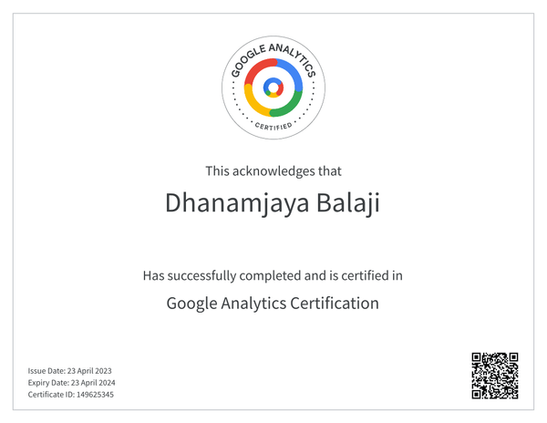

# Google Analytics 4

In April 2023, I got Google Analytics 4 certified. Here is the proof and the credentials are secured on the blockchain through [accredible](https://www.accredible.com/) website.

Upon completion, you receive a certificate which is valid for an year

and you would receive a badge that can be used on email signatures, resumes, ppt, etc.

Let us get into the details of the certification and the process behind it.

## What is Google Analytics

Google Analytics is a free web analytics service provided by Google that tracks and reports website traffic. It is a powerful tool for website owners, marketers, and analysts to understand user behavior and optimize website performance. Google Analytics collects data such as the number of visitors, their demographics, the sources of their traffic, the pages they visit, and the actions they take on the website. This information can be used to make data-driven decisions about website design, content, and marketing strategies. With Google Analytics, you can measure your website's performance, track your marketing campaigns, and gain insights into your audience, all of which can help you achieve your business goals.

## What is Google Analytics 4 certification about?

By getting google Analytics 4 certification, you demonstrate the below qualities

- You understand and are proficient in Google Analytics 4
- You demonstrate your understanding in working with data collected in Google Analytics.
- You demonstrate integrating Google Analytics and Google Ads.
- You understand data streams and implementing Analytics for IOS & Android apps.
- Practice or play around with Google ecommerce store analytics dashboard which is real.

## Who should take up this certification?

As a web application developer, blogger and implementer of Google Analytics, it was naturally the right thing for me to get Google Analytics certification. Here is my checklist for someone who is considering Google Analytics certification.

1. Your nature of work includes implementing Google Analytics or some digital analytics to webapp, IOS app or Android app or all the above.
2. You have products where you would like to use Google Analytics and collect data.
3. You work with webapps or mobile apps and you like to understand how Google Analytics works

## Who should not take this certification?

- Developers who are just getting started
- Developers who are working with other developers, tech leads and have no business exposure

## What does this certification truly evaluate?

- The certification is tightly coupled with [Google Skillshop](https://skillshop.withgoogle.com/) curriculum. You have roughly 5 hours of video content and quiz which is **highly recommended**.
- Anyone who has dedicated to the course mentioned above can pass the test.
- The test evaluates your awareness and not the practical side or application of the Google Analytics which in my opinion is harder to evaluate and certify.

## Resources

To pass the test, you need not look at paid courses or extra material. To get extra knowledge, you might visit paid courses.

Checkout [Skillshop GA4 page](https://skillshop.exceedlms.com/student/catalog/list?category_ids=6431-google-analytics-4&utm_campaign=redirect&utm_source=analytics-academy&utm_medium=banner) and painstakingly go through the courses, take notes, remember, etc. This course is important.

## The test

- The test is free
- The test is not proctored
- The test has 50 questions and 90 minutes
- Pass percentage is 80%
- The test results are available instantly
- Retake is allowed after few days
- No multi correct answers, its one correct answer out of 4
- Topics around integrating GA with ads, taking data to BigQuery were hard.

## Summary

You may not get a standing ovation at work for taking up with certification and passing it. However, it is a nice to have on your resume if you have relevant line of experience.

## Relevant links

- https://analytics.google.com/analytics/web/
- https://analytics.google.com/analytics/academy/