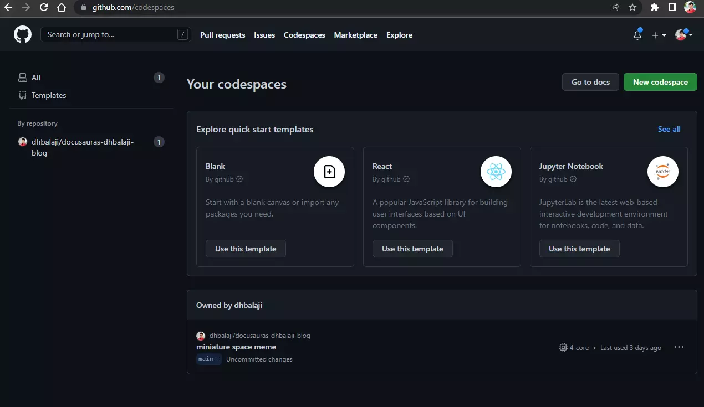

# Github Codespaces & Dev Containers



I have worked with several software teams were setting up the local host ranges from intimidating to impossible. This resulted in wasted hours of development and a new category of bugs.

I was looking for a wonderful development environment where I don't have to worry about switching node JS versions, or setting up some specific environment variables. This would have been a fantasy if it wasn't for `dev containers`.

## Dev containers

For those who are new to dev containers, this is a new concept where we use docker images for the development of software. We essentially take a VM and run an image with the OS of choice. Later customize the image with the tools required for the development. Most of this activity happens through code configuration making it easy to automate.

> Goodbye, setup document. You were always out of date too.


## Github codespaces

I want to discuss how GitHub code spaces are helping developers do great things with less work, especially about their code, workstation configuration & local setup

Before I jump into code spaces I want to emphasize that codespaces are based on a spec that indicates how to use containers for development purposes. GitHub took the idea to a new level by introducing a docker container that can be run on the cloud.  when you want something on the cloud it includes a lot of costs. Is GitHub giving all these resources for free the answer is yes and no? It is yes when you consider the 1200 minutes or so container time that you have for a free account in GitHub. It's a no when you want an advanced virtual machine to work with because by default you get a fixed configuration to work with.

## Getting started 

To try out the development containers here is the first thing that you need to do.  pick between the established IDEs which support dev containers. You need vs-code or JetBrains IDE. when you have vs-code you also are required to download an extension that is going to give more power to the IDE. Then the IDE is in a position to do the sync between your local file system and the container so that you are code right is not just executed within the container but the copy is also saved on your local hard drive when you shut down the container. You also get meaningful alerts like opening the container, rebuilding the container & open the forwarded port.

You don't have to write a lot of code to spin up at the container but you have to write a good amount of configuration, for example, familiarity with docker is always going to help you when you work with a dev container however I do not have a great family it with docker except for that I know that you can run containers, create and manage containers. 

The first step for you is to create the configuration file which would help you create the container you wanted to work with. The configuration file sits inside a folder called `.devcontainer`. the .devcontainer contains a JSON file that includes the name of the image, nodeJS, container hooks, and features you want the image to include. The container has access to the same host network so you don't have to write any extra proxy or anything but this is one separate machine that is running inside your host.

### Advantages

 Overall it reduces the time for setting up and sharing the development setup because all of your development setups are now in the configuration and it should execute seamlessly as long as the other person is also running the docker desktop or its equivalent on their machine.

## Verdict

If your team has powerful computers and wanted localhost to be up all the time, then dev containers are the right tool for you.

If your team uses localhost sparingly, like marketing website updates, etc. Then the GitHub codespaces would be a fantastic option.


## Sample devcontainer.json of this blog

```json
{
  "name": "dhbalaji-blog",
  "image": "mcr.microsoft.com/devcontainers/javascript-node:18",
  "features": {
    "ghcr.io/devcontainers/features/github-cli:1": {}
  },
  "settings": {
    "terminal.integrated.shell.linux": "/bin/bash"
  },
  "extensions": [
    "dbaeumer.vscode-eslint",
    "isudox.vscode-jetbrains-keybindings",
    "esbenp.prettier-vscode"
  ],
  // Use 'postCreateCommand' to run commands after the container is created.
  "postAttachCommand": {
    "server": "npm start"
  },
  "portsAttributes": {
    "3000": {
      "label": "Blog",
      "onAutoForward": "openPreview"
    }
  },
  "hostRequirements": {
    "cpus": 4,
    "memory": "8gb",
    "storage": "8gb"
  }
}
```

## References

[containers.dev](https://containers.dev/)

[VS code dev containers](https://code.visualstudio.com/docs/devcontainers/containers)

[Github codespace](https://github.com/codespaces)