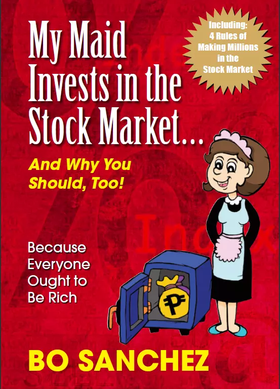

Let me start with my favorite line from the book.

> If you do not own a business, you should invest in business.

Financial books are the least favorite of readers because of 2 reasons.

- Most financial books give orthodox advice which suits the stoics or individuals. Most normal people are not stoics, they have retired parents to take care of or they need to fund their sibling's education.
- Most stock market books are not written for lower-wage earning audiences. They have a point, how can someone poor invest in a portfolio of stocks? But this author gives hope to people with day jobs.

But this book is different, I am glad that I picked this read. This book is written by the author keeping their maids in mind who represent the young working-class audience. 

### Characters in the book

There are 3 main characters in the book

- The financially savvy author who lives in Philipines
- The maids who work at the author's home
- The company owned by the author and its clients

I liked the way the maid's persona was explained. The maids are young, working at the author's home to make money. They are good at saving money. They send some money back home so that their family eats and lives happily. The maids are also burdened with the task of meeting financial emergencies which could arise in the family like bad health etc.

### Best ideas from the book

It's a short book and a light read which can be read in an hour. It has 84 pages which are filled with great ideas. Here is my favorite part of the book.

Most books I read treat finances differently. The investment banker would not consider middle-class family problems like sending remittances back home to feed the family while writing a book on the stock market.

The author calls out a phrase called "Feeding the civilization", which means that the breadwinner has 2 families to take care of.

- The family consists of the breadwinner, spouse, children &
- The family consists of breadwinner parents, breadwinner siblings, etc

Already the maids are working on a smaller wage but they have 2 families to take care of. So the maids are going to retire in a financially handicapped situation at old age because retirement is real. The employer whom maids have worked with and the family whom the maids raised are going to desert them when the maids are old and have no money to take care of themselves.

The author mentions a formula to separate your money once you get your monthly wage

- Tithe fund - 10% for Charity so that it creates an abundance mindset. The author is an advocate of God and religion.
- Expense fund - 15% for Daily expenses and recreation.
- Support fund - 30% for your family living in the village or elsewhere as a remittance so that they eat and live
- Retirement fund - 30% for Retirement fund which sits in the share market and is built by monthly investing into the giant company stocks even during a market crisis
- Emergency fund - 15% for the emergency fund which sits in the bank so that you do not break the retirement fund if a crisis hits

> By investing 30% of the salary into the retirement fund for 20-plus years, the maids can retire as a millionaire.

The authors advise the maids to avoid

- Trading
- Investing in risky stocks or penny stocks

### Something that I do not agree with

10% of the salary to God or Charity for the maids is something I do not fully agree with. It's a good idea but I doubt if it's actionable.

10% of the book goes into explaining the trading company where the author works. It makes sense only for that geographic area but it does not apply to everyone who reads the book. A hyperlink to a blog article would have helped.

### Verdict

If you are looking for a short book, under 100 pages that resonate with working-class people. This book is for you. The author promises that his investing strategy of buying a certain sum of top company stocks for 20 years systematically is going to make you a millionaire.

> Is there anyone who does not want to become a millionaire when they retire? I guess not so this book is for you.