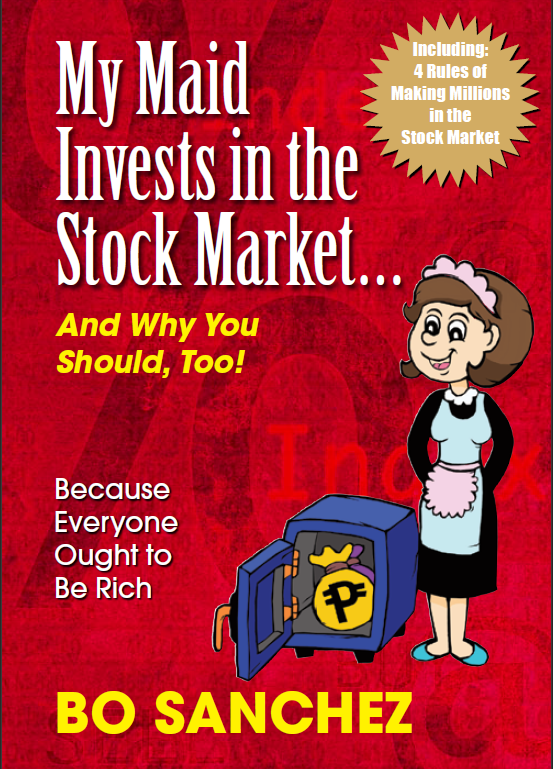

Let me start with the favorite line from the book.

> If you do not own a business, you should invest in a business.

The financial books are the least favorite of the readers because of 2 reasons.

- Most financial books give orthodox advice which suit the stoics or individuals. Most normal people are not stoics, they have retired parents to take care off or they need to fund their sibling education.
- Most stock market books are not written for the lower wage earning audiences. They have a point, how can someone who is poor invest in portfolio of stocks. But this author gives a hope for people with a day job.

But this book is different, I am glad that I picked this read. This book is written by the author keeping their maids in mind who represent the young working class audience. 

### Characters in the book

There are 3 main characters in the book

- The financially savy author who lives in Philipines
- The maids who work at the author home
- The company owned by the author and its clients

I liked the way the maids persona was explained. The maids are young, working at authors home to make money. They are good at saving money. They send some money back to home so that their family eats and lives happily. The maids are also burdened with task of meeting financial emergencies which could arise in the family like bad health etc.

### Best ideas from the book

Its a short book and a light read which can read in an hour. It has 84 pages which is filled with great ideas. Here is my favorite part of the book.

Most books I read treat finances differently. The investment banker would not take middle class family problems into consideration like sending remittances back home to feed the family while writing a book on stock market.

Author calls out a phrase called "Feeding the civilization", which means that the bread winner has 2 families to take care.

- The family consisting of bread winner, spouse, children &
- The family consisting of bread winner parents, bread winner sibilings etc

Already the maids are working on a smaller wage but they have 2 families to take care of. So the maids are going to retire in a financially handicapped situation at old age because retirement is real. The employer whom maids have worked with, the family whom maids raised are going to desert them when maids are old and have no money to take care of yourself.

The author mentions a formula to seperate your money once you get your monthly wage

- Tithe fund - 10% for Charity so that it creates a abundance mindset. The author is a advocate of God and religion.
- Expense fund - 15% for Daily expenses and recreation.
- Support fund - 30% for your family living in village or else where as remittance so that they eat and live
- Retirement fund - 30% for Retirement fund which sits in the share market which is built by monthly investing into the giant company stocks even during market crisis
- Emergency fund - 15% for emergency fund which sits in the bank so that you do not break the retirment fund if crisis hits

> By investing 30% of salary into the retirment fund for 20 plus years, the maids can retire as a millionaires.

The authors advices the maids to avoid

- Trading
- Investing in risky stocks or penny stocks

### Something that I do not agree with

10% of salary to God or Charity for the maids is something I do not fully agree with. Its a good idea but I doubt if its actionable.

10% of the book goes into explaining the trading company where the author works. It makes sense only for that geographic area but its not applicable to everyone who reads the book. A hyperlink to a blog article would have helped.

### Verdict

If you are looking for a short book, under 100 pages that resonates with working class people. This book is for you. The author promises that his investing strategy of buying certain sum of top company stocks for 20 years systematically is going to make you a millionaire.

> Is there any one who do not want to become millionaire when you retire? I guess not so this book is for you.