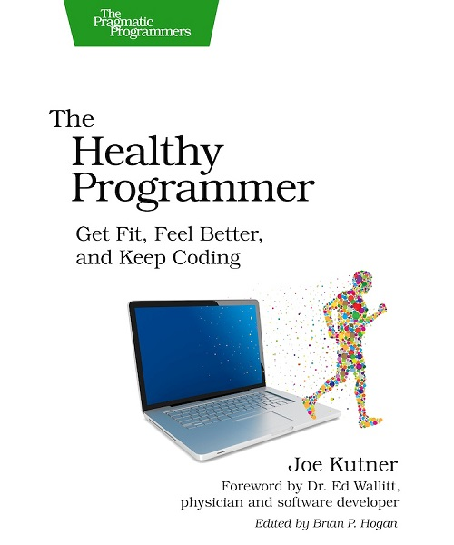

Hey there, lets discuss a book which explains health in a way which would captivate techies (techies here refers to people who sit before keyboard) around the world. This book aims at refactoring your health. The book is titled "The Healthy Programmer". As a programmer myself I did not think twice before picking this book and read this book immediately. Let me explain how this book felt in parts.

**Disclaimer:** Health related books are intended only as an informative guide for those who wish to know health related aspects however these books should not be treated as replacement over licensed healthcare providers. Don't be the DIY guy trying to immunize or treat himself all the time.

> Amish communities are known for their embrace of a rural lifestyle, manual labor, and a reluctance to adopt modern technology. It’s a far cry from the world of programmers, where we have to remind ourselves to get outside and walk around every now and then.

## About the author

## The best parts of the book

I love to read this book because the hacker slang creeps into the pages aptly. The book starts with `Lets Refactor your Health`. Thats what most of us want anyways. Here are some of the good parts.

### Lets unit test our health

Before performing refactoring on our body, lets perform a few unit tests like

- Do you lose your breath after climbing a single flight of stairs
- Do you regularly site for more than one hour without getting up?
- In the last year have you experienced back, neck, shoulder or wrist pain
- In the last week have your eyes become dry, red or difficult to focus
- Have you eaten until you were comfortably full more than once in the last month
- Have you been exposed to direct sunlight for less than 10 minutes today
- Is it uncomfortable to bend over and tie your shoes
- Has your pant size increased significantly in the last 5 years

Its no brainer to figure out the associated risks related to each unit test. Once we identify the risk, we can plan to mitigate the risk.

### Quick checklist to visit daily

- **Plan** for health standup
- **Walk** for 10000 steps with 20 mins brisk
- **Move** 5 mins/hour. Change position every 20 mins
- **Eat** 5 servings of fruits and vegetables
- **Build** 5 Body building exercises

Conduct a daily health standup

- What did I do yesterday to improve my health
- What will I do today to improve my health
- Is there anything blocking you from staying health

### Relation between exercise & learning

Programmers are life long learners & an avator of students. Learning and keeping ourselves up to date is indispensible. one of the best ways to enhance your ability to learn is to get some exercise. There’s also a lot of laboratory evidence showing that our brains work better when our bodies are active. In particular, they become better at remembering new concepts, ideas, and patterns.

> Studies show that doing exercise before or after learning something new can help you remember it.

### Say hi to walking briskly

Walking is our first guard in defence against lifestyle disease. Use the pedometer on your phone or wrist band and clock 10000 steps every day. To get better results, walk often. Hitting the gym and sitting for 15 hours is not really effective.

Walking 10000 steps in a day does not capture intensity, instead target the daily total of 10k steps to come from spurts of 3,000 steps in thirty minutes or 1,000 steps in ten minutes to ensure that some of your walking is done briskly.

### Other tips

- Get a minimum of 20 minutes exercise every day
- Watch your resting heart BPM. Measure and ensure BPM does not go up as you age. Losing weight, reducing stress could be useful strategies
- Mitigate the risks of sitting by
    - Sit for 20 minutes
    - Stand for 20 minutes
    - Walk if you can instead of stand
    - Change between sitting and standing often
- Every 20 minutes, focus on something 20 meters 
- Here is how you can boost immunity
    - Get enough sleep
    - Drink enough water
    - Avoid antibiotics
    - Eat fermented food
    - Get your vitamin D

## Something that I do not agree with

I do not agree with `Agile dieting` as mentioned in the book. Well, maybe the times have changed. Professionals can come up with specific diet programs which give better results

## Verdict

You cannot fool nature. You have to read this book because your quality of job & life depends on your health. Give yourself the joy of being healthy.

> Movement is the key to being healthy. Sitting for long hours is a death sentence for programmers.