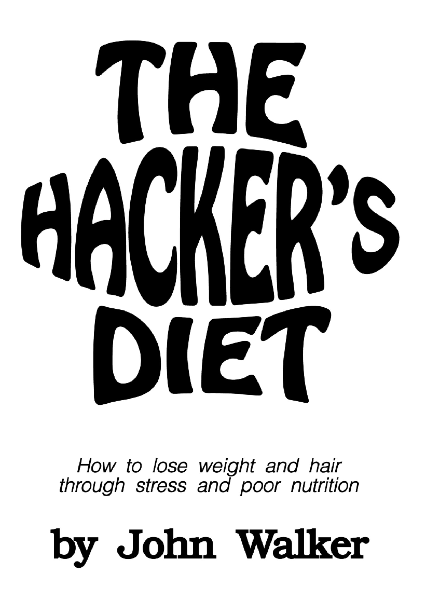

Hi, we are here discussing an another health related book. You may ask, why an another health related book? thanks to book discovery that happened through previous read. The previous book had a mention of another health book for programmers so I picked this book titled **Hackers Diet by John Walker**.

## About the author

General trend of a health author profile looks like nutritionist, sports hero, chef or someone with a great body. Here we have an author who was fat most of his life. The author is founder of AutoDesk, the autocad software company and he is wondering about his success at work but failure at shedding his weight.

The author thought that fat was a problem to be solved and not a burden to withstand. Once he solved his weight problem, he is sharing the tools with us so that we live long and prosper.

The author has great expectation on the readers or his audience who want to lose weight. The audience should have 

- An eye firmly fixed on the goal
- Will power
- A high tolerance for pain

The author throws light on the word hacker. `
Hacker is a person who derives joy from discovering ways to circumvent limitations.
`

## Timeline of the book

The book was written in 1991. 

## Nature of weightloss strategy

No prizes for guessing the theme of the book, i.e. How can I lose weight?

The author says "Eat less food than your body burns".

## Good ideas from the book

### Eat watch

Its a hypothetical concept which tells when you should start eating and when to stop. This concept is based on the fact that **if people did not eat except when their bodies needed food, nobody would be overweight**. Let hunger tell us the time when we should eat instead of the convention like meeting friends or family dinner etc.

For the eat watch to work, the food you eat need to give feedback to the body to stop eating. Slim people have this built in eat watch which tells `enough already` but in others that circuit is broken.

To control weight, you need to eat the right amount of food for the rest of your life. This requires motivation and manipulation. Motivation comes from will power. Manipulation is the techniques you use to deceive yourself, lets say its half past 9pm, lets exercise tomorrow. To control manipulation, we need empowerment.

If weight is managed rightly, you are about to partake of a new and rich part of the human experience, the exultation of living in a healthy animal body.

### Know the basics

There are 3 parts to make a note of while losing weight

- What we put into the body in calories, we can control this
- What amount of input calories get burnt in calories
- What goes out of the body, we can ignore the measurement of this.

It takes approximately 7000 calories to add a kilogram of weight to your body. It's a glorious idea to control your weight without changing the way you eat, but like so many attractive ideas, it doesn't work. Don't delude yourself into thinking that exercise can do the whole job. For many of us, exercising just causes us to eat that little bit more that cancels out its benefits. The calories burned by exercising, even counting the secondary effects on metabolism, can be erased by even the slightest increases in food intake.

> Permanent weight control requires permanent attention to what you eat. Life long, permanent attention.

### Benefits of exercise and meal planning

Exercising not only gives you more time to live, it makes the time you live more enjoyable. You'll feel better, think straighter, sleep more soundly, and have more capacity and endurance for everything you wish to do. Regular exercise greatly reduces the effects of altitude. As you exercise, you increase the capacity of your heart to pump blood and your lungs to replenish the oxygen it carries.

Meal planning for predictable calorie intake is the central management tool which closes the circle and achieves control over weight. Meal planning requires total control over not just what you eat, but also how much. Also eat at the same time everyday. Avoid eating before sleep.

> The faster you eat, the more you get.

Here are steps to implement weight control loop / feedback system

1. Estimate calories
2. Plan meals
3. Log weight
4. Find trend and adjust estimation of calories
5. Repeat from step 1

### Stress

Stress is unavoidable consequence of living in our fast-paced high tech culture. Stress is a primary cause of overeating and weight gain.

## Something I wont agree with

Of course, the modern science is vocal about metabolic disorders which could make a person fat. The author is fixated on the idea that our body is a pure function and the system can be mathematically modelled all the time.

## Verdict

Though the book has been written 3 decades ago. The fundamental ideas are the same.

- Eat in moderation
- Deliberately starve yourself to good life
- Avoid packaged food inspite of their tall claims
- Exercise to beat cholestrol & fat
- Use excel sheets for some good cause like tracking calories, weight etc

If you want to pick a health related book written by a engineer who built a great company, writes about planning with excel, talks about moving averages, lots of formulaes, etc then this book is for you.