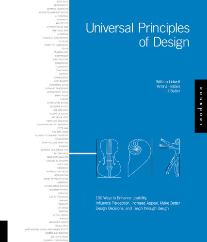

Design is a subjective topic and point of debate in several corporate meetings. The debate happens due to `Cognitive Dissonance`, `exposure effect` & `consistency bias`. But wait, the last 3 terms are common in design world and are universal to design. This book does not talk about how to design an app but this book helps you take an insider view of design, process and patterns in design.

## About the style of writing

This book is short read, something you can read on a short plane. The book is written with beginners and average joe who encounters design in his life. The audience could be software developers or marketing or someone who makes ad films.

The book has around 105 topics which are spread around 5 topics like perception, learning, usability, appeal and design decisions.

The left side of the book has short theory of the topic, the right side of the book has real life examples about the design topic.

## About the author

The authors hold emminent positions in various firms and institutes. Their intention is appalaudible, that is to help normal folks understand universal design principles with ease.

## Best parts of the book

As I am a software developer, here are few topics which I liked from the book

- Accessibility

Objects and environments should be designed to be usable without modification, by as many people as possible.

- Development cycle

Successful products typically follow four stages of creation: requirements, design, development and testing. All products progress sequentially through basic stages of creation.

- Requirements - gathered through market research, customer feedback, etc. Design requirements are derived from direct knowledge or experience
- Design - the stage where design requirements are translated into a form that yields a set of specifications. Excellent design is usually accompolished through careful research of existing or analogous solutions, ample use of prototyping and many iterations of trying.
- Development - the development stage is where design specifications are transformed into a actual product.
- Testing - The stage where the product is tested to ensure that it meets design requirement and specifications and will be accepted by target audience.

- Feedback loop - A relationship between variables in a system where the consequences of an event feedback into the system as input, modifying the event in the future. Every action creates an equal and opposite reaction. When reactions loop back  to affect themselves, a feedback loop is created.

    Positive feedback amplifies output, resulting in growth. Negative feedback dampens output, stabilizing the system.

- Immersion - A state of mental focus so intense that awareness of the real world is lost, generally resulting in a feeling of joy and satisfaction.

    When preceptual and cognitive systems are under taxed, people become apathetic and bored. If they are over taxed, people become stressed and frustrated. Immersion occurs when perceptual and cognitive systems are challenged at near capacity without being exceeded.

- Confirmation - A technique for preventing unintended actions by requiring verification of the actions before they are performed. Confirmations are used to prevent a class of errors called slips. Confirmations slow task performance and should be reserved for use with critical and irreversible operations.

## Verdict

A wonderful book to get an introduction to the world of design. The knowledge of universal design is going to impact all walks of your life, for instance you wont look at `Apple Store` as a mere structure. The Apple store is a classic example of Orientation Sensitivity and threat detection.

This book is a non technical read and must read to walk and live with design sanity.