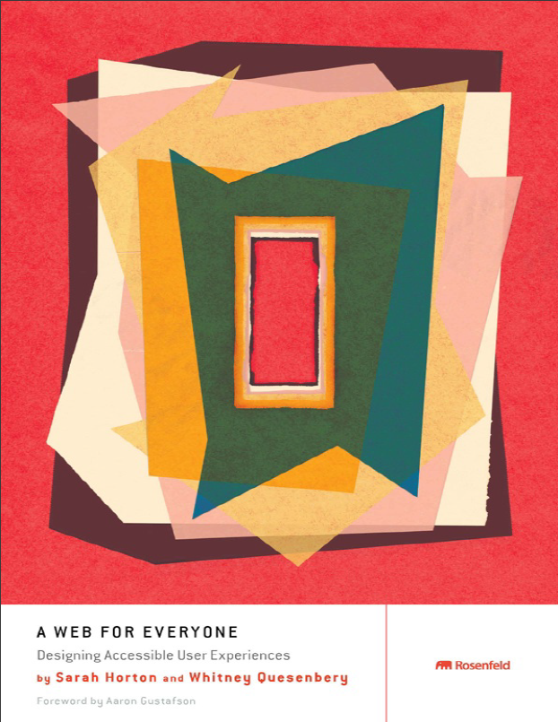

Equality on the web is an interesting and important topic. This is the second book related to accessibility.

## Who should read the book

Books on accessibility relates to design or coding. This book relates to 80% of design and 20% coding. If you are beginning with accessibility, then this book is the right fit.

## About the author

Author is well exposed to accessibility and web. Sarah Horton is definitely an expert from whom we want to learn and understand accessibility design.

## Top ideas from the book

1. The personas of the disabled people

Generally books categorize people with disablility and stop there. But the authors takes this issue description in a well recognized technical language called `Personas`. The persona description and images of the users illustrate the readers about the user. This is important because all our lives we are not exposed to disabled people to a major degree.

2. Equations to simplify ideas

> Ability + Barrier = Disability

Barrier is to be breaken with technology. For example, if an user has bad vision then we need to help them consume our content with screen magnifier or screen reader. Web content should be accessible to disabled audience

## Verdict

The book is an intense literature. As a frontend developer, I could understand the design process and a gentle introduction to WCAG 2.0. This book stands out with personas about disabled people. It helps you to emphatize with disabled people.