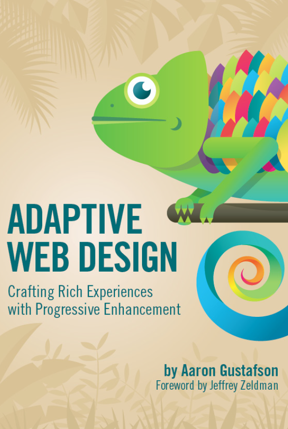

Written in 2013, a book on adaptive web design and how to do it with progressive enhancement. The title of the book might sound mouth full but let's look into it in parts. 

Adaptive web design is the elder kin of responsive web design (RWD), Read more about [RWD vs Adaptive web design](https://xd.adobe.com/ideas/process/ui-design/adaptive-design-vs-responsive-design/). In the context of the book, the book is a how-to literature on how to do adaptive web design. The main technique that was discussed was `progressive enhancement.

## Top ideas from the book

> Think of the user, not the browser

### Progressive enhancement

Progressive enhancement - the gold standard of how to approach the web. It's aimed at crafting experiences that serve the users by giving them access to content without technological restrictions.

Progressive enhancement relies on fault tolerance. A system can operate when it encounters an unexpected error.

Browsers play by the rules of fault tolerance and ignore anything they did not understand. Fault tolerance has been a part of HTML and CSS since the beginning. They are forever forward-compatible.

We all have special needs, and progressive enhancement wins.

### Tools for Progressive Enhancement

HTML and CSS are ideal tools for progressive enhancement. Javascript is not fault-tolerant, it breaks with an error. If the user turns off Javascript, the user is shown a blank white screen most of the time.

An ideal developer will have to check before executing JS and JS APIs.

### Helping assistive tech with ARIA

A gentle empathetic introduction to ARIA is always welcome. The book discusses

- `aria` states

- `aria` roles

- `tab index`

## Verdict

A light read written in 2013. The world has moved towards working and testing apps on browsers with major browser share. The book reminds us of the importance of building sites/apps for past and upcoming technologies. After a long time, I was able to weigh in progressive enhancement vs graceful degradation. Overall an interesting light read.

> Browsers ignore anything they do not understand

The above line could be applied to life too!