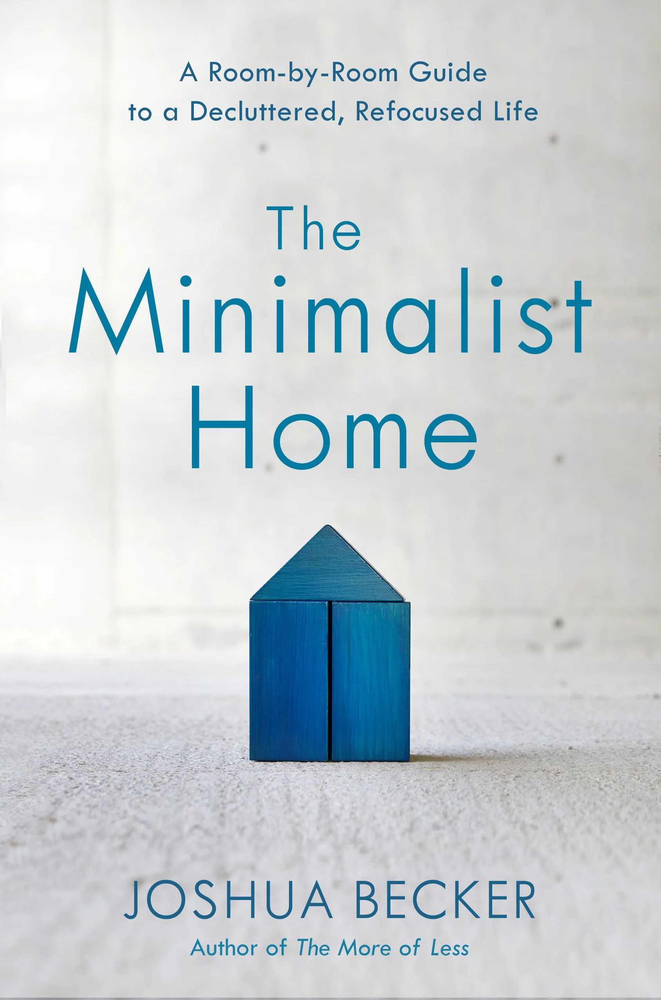

I have been reading books about all things that matter in life. This is the first book about the most important place on earth "The Home". Each one's home is unique and I am going to talk about this book from a working-class person living in India.

> Home is a place for rest & focus. Find alignment between purpose & possession in life.

## About the author

The author is a minimalist guru and a staunch advocate of minimalism. If you are going to search for the word minimalist on any search engine or social media platform, you might run into the works of Joshua Becker. He has written multiple books on the topic of minimalism.

> Goals shape us, goals change us

One of the ideas from his previous books which I follow meticulously is `remove duplicates`. Have 2 towels instead of 5. Wash the blankets and use them within the same day. You do not need to maintain multiple blankets.

## Why minimalism

> Prioritize extra time in hand and extra money in your pocket over extra things in the closet.

I wanted you to observe the people around you. Some of them are super focussed on the things they do and deterministic about the things they own. While a vast majority of them are otherwise. If you lift your head and observe some legendary people like Steve Jobs & Mahatma Gandhi, they were leading a minimalist life. They were spearheaded about the mission of their life. Both Steve Jobs & Gandhi were not popular because they wore fancy dresses/clothing most of the time. They did not own fancy homes but the outcome of their work and the value they brought to the world is immeasurable. 

In success literature, it's a trend to observe and reverse engineer the qualities of successful people or reverse the trend which is followed by the masses. In this context `minimalism` has hit a niche market and there is a good amount of education, adoption, and evangelism available out there.

> You are bound by home instead of being freed by home.

Let's answer the `why`, Minimalism is a philosophy so it's hard to punch in a scientific definition of minimalism. Minimalism is about focusing on things that matter to you and your goal in life. A minimalist tries to turn his surroundings, tools, and thoughts toward the main goal in life.

Let's observe Steve Jobs, he believed in good design. According to Jobs, design is not how it looks but how it works. His car, dress, office, products, and entire life were obsessively driven by design instead of being missold to random ideas or whims of the market. Nevertheless, he achieved great things in life.

> Reimagine the environment around the goals in life.

## Top ideas from the book

The book is written around the topic of "Home". The author prescribes how to approach each room as a minimalist. Of course, if you were to follow this book. You might expect trouble from your family or roommates and the author has written about that too.

> If your house does not have a basement, then your bed storage is your basement.

### Stuff problem

Once in a while, Indian moms yell at their children for bringing home something useless. But the child feels it's the best thing they could buy in their life. As a grown-up adult, I purchased a few things which I am not proud of like expensive home gym equipment which was not used at all. My mom complained right on the day of purchase and even showed me alternates like running or using body weight. Let's say I did not have a mom and I go binge shopping. I would be left with 10 items sitting on the floor because they did not have a shelf to sit on all the time. My room would turn into a cave with all sorts of things that I do not use. That's exactly what the author calls out as a stuff problem. 

> If you have nice things to impress your friends, then you got the wrong friends.

People with stuff problems have trouble with shifting homes, spending more time on the upkeep and lastly, they cannot say where their things are. They keep misplacing things and spend a lot of time searching for them. Simple things like walking in the dark are not easy because they have stuff sitting on the floor. I have personally seen some Indian homes where the guests can clearly call out as a mess. Some guests would even give advice like "why don't you clear the textbooks from school which are stacked up on the floor in a corner of the room?

> Nothing on the floor except 4 pieces of furniture per room.

### Minimalism dividend

If you were given a chance to go back in time and were given a full refund for exchanging all the things you emotionally bought, how would more extra cash you would have? You would definitely have more money today. Imagine if you had invested correctly instead of buying things, that investment would have given you dividends.

If the above advice sounds too strict, hear it out. As a minimalist, you will buy things and some of your purchases might end up as clutter. But compared to a normal soul who is spending on things and loading his house with 30,000 items, you are doing much better.

Do not go by what advertisers call it out as trend-like colors to wear this summer etc. By not falling into consumerism, you avoid debts. This is an advantage of being a minimalist and this is what the author calls a "Minimalism Dividend" just like stock dividends.

> Refusal to buy things that waste money and take up clutter pays you minimalist dividends.

### Do not relocate items

Most of us have done this. Let's say you purchased a flower vase thinking you would decorate it with beautiful flowers once a week. But as time goes by, the flower's cost and upkeep make you wonder if it's worth it. In that case, you accept the defeat and pack the vase and relocate the vase from display to a box in the basement. The Indian version is "top shelf of the room or below the bed". That's it, you forget and move on but that item is still sitting somewhere and adding to the clutter count.

Instead, the author recommends you donate or sell it at a garage sale. The Indian equivalent of a garage sale is `olx`. Either use the item or discard it. Before you discard it, run it through a small checklist like if your family member would get angry, when did you last use it? etc.

## Ideas I do not agree with

At the shopping mall or supermarket, the things we buy fall into 2 categories. They are `Consumables` & `Durables`. The `Consumables` are food items, natural flowers, etc. The `Durables` are books, toys, and furniture. The author recommends buying consumables instead of durables as the consumables are spent for experiences but later bought for future use.

I like what the author says. Sometimes the books we do not start reading the books we read but we hold it thinking we will read them someday. The same with the DSLR camera which we bought. The authors advocate renting durables.

Having said that it's a noble idea to vote for consumables but not all consumables are safe. What if someone buys an addictive substance because he is not going to spend on durable? It's a possibility. 

The Indian version would be to ask your mom/spouse to supervise the money for you. It works most of the time. 

> For investments, contact an advisor. For spending, you need a regulator.

## Verdict

Overall the book is an intermediate-level read where the reader is supposed to read and make changes not just to himself but to the lifestyle of the family. The goals of each room and the refusal to buy things that do not bring value or simply clutter are absolutely great ideas to explore at a young age. 

If you are someone who walks with a plan, integrates parts of your life by design, and is willing to be counter-cultured, this book is for you. I will leave you with a quote from the book which I believe is so true.

> Picture your dream home in mind, I bet it's not filled with clutter
