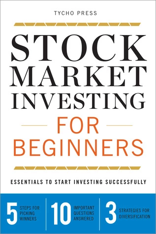

My last book talk was on the topic of minimalism at home. As an effect of minimalism, we are going to save money and gain minimalism dividends.

Extending those lines, we are going to discuss another book on the topic of money. It's about stock market investing for beginners by Tacho press.

I remember this vividly, ever since I started watching the news on the television. There will be a 1-minute bulletin showing the Bombay stock exchange and just sharing the BSE Sensex numbers and the remaining 25 minutes for news.

I come from a country where financial literacy with technology is not widespread. Most Indians still rely on agents to walk into the door and pitch financial products.

Ask any Indian home about the stock market, they would say that it's a sure-shot way to lose money. That's because the stock market is not a place where your ambitions are respected, it's a place where process, research, and hard work are respected. 

> Losing money on taxes should not be the only reason why you should not sell profitable stocks after many years of holding them.

## Why read this book

This book helps you put the leg in the door of the stock market. The book talks at length about three main concepts and a lot of questions for beginners.

The book does not give stock calls or techniques. This book is mostly theoretical and filled with general advice.
Some topics from the fundamental and technical analysis are touched upon.

> 10 hours of portfolio management per week shows poor time management. Spending less than an hour per week is foolishness.

## About the author

Frankly speaking, there isn't a face behind the book or a page thanking mother/wife, etc. This book is published by a corporate author. That's all we know.

This is good in one way because we do not have to emphatize with their anecdotes. We can read the facts and go ahead.

## Top ideas from the book

### Access the stock from 3 angles

- Valuation - undervalue stocks preferred
- Growth - check the past 5 quarters' growth
- Profitability - check the profitability of the business and compare it with the industry

> news is a part of the stock investing game

### Selecting stocks

- Identify a sector where you have some knowledge
- Select 10 stocks in the sector
- Perform valuation analysis
- Perform growth and profit analysis
- Remove bad apples from the rest. You would have identified 1 or 2 good stocks out of 10.

> Believe in what you read, now what you hear

### Diversification

- Buy multiple stocks -holding 25 to 35 stocks is not the only sign of diversification
- Buy from at least 6 sectors
- Buy different types of investments like bonds, stocks, etc

> If all stocks are falling, you need not be concerned. If only one stock is falling while others are moving up, then we have a problem.

### Finding the percentage of stocks and bonds

- Minus your age of 110, that should be your stocks and the remaining is bonds. A 40-year-old can have 70% stocks and 30% bonds
- If you are wealthy, you can bump up stocks allocation another 5%

## Ideas I do not agree with

Most of the book is based on factual information, there are no personal viewpoints of the author that I disagree with.

## Verdict

Most young Indians approach the stock market with the mindset of making 1% to 10% percent returns every month. They make a lot of trades and no wonder they make big losses in the first 5 years.

This book does one thing really well. It gives you pointers that act like guard rails so that you can approach the stock market and make money safely. It's a recommended read even for intermediate-level stock market professionals.

> A stock market beginner should not do a lot of trades.