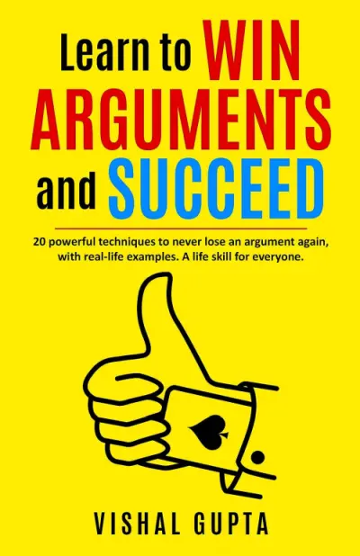

Arguments often have a bad reputation, associated with raised voices, negative emotions, and anger. We tend to avoid them, viewing them as something to be steered clear of. After all, arguments are typically reserved for courtrooms and formal debates, right? Well, not quite. Vishal Gupta, an engineer and a criminal side lawyer, believes that mastering the art of argumentation is a life skill that everyone should cultivate. In his book, "Learn to Win Arguments and Succeed," Gupta sheds light on how to engage in constructive, persuasive arguments that help you convey your viewpoint effectively.

Here are three valuable takeaways from the book that anyone can use to enhance their argumentative skills:

## 1. Proverbs: Less is More

Proverbs have held a special place in our society for centuries. Instead of using a multitude of words to make your point, proverbs condense wisdom into succinct phrases. Take, for example, the timeless adage, "as you sow, so shall you reap." This simple proverb can be a powerful tool to persuade someone to take responsibility for their actions. By utilizing such wisdom, you can make your arguments more concise and compelling.

## 2. Repeat, Repeat, Repeat

Some arguments can be grueling, particularly when the stakes are high. Picture a scenario where someone has damaged your motorcycle and is falsely accusing you of mistakes. Instead of getting lost in the chaos of defending yourself against every accusation, Gupta suggests a different approach: repetition. By consistently and calmly repeating your strong defense, you can guide the conversation toward a resolution. Repetition can help your opponent notice and, ultimately, accept their mistake.

## 3. Loaded Words: The Power of Emotion

In the art of persuasion, emotions play a crucial role. Loaded words, as Vishal Gupta explains, are terms or phrases that carry strong emotional connotations. These words are designed to sway opinions, evoke emotions, and manipulate the audience in various ways. For instance, instead of using plain language to accuse someone of their mistake, try employing loaded language to vividly illustrate their error. Words like "injustice" can evoke a profound sense of unfairness, making your argument more emotionally resonant.

## Summary

"Learn to Win Arguments and Succeed" is a must-read for anyone who encounters situations where persuasive skills matter, be it at work, in relationships, or elsewhere. The book offers a comprehensive set of techniques and strategies that can help you emerge victorious in debates while preserving respect and understanding in interpersonal relationships. Vishal Gupta's experience as an engineer and a lawyer makes him a credible source to guide readers through the art of argumentation. So, next time you hear someone say, "Don't argue with me," you'll be better equipped to navigate the discussion with finesse and persuasion. This book teaches you that arguments can be constructive, and mastering this skill is essential for everyone.