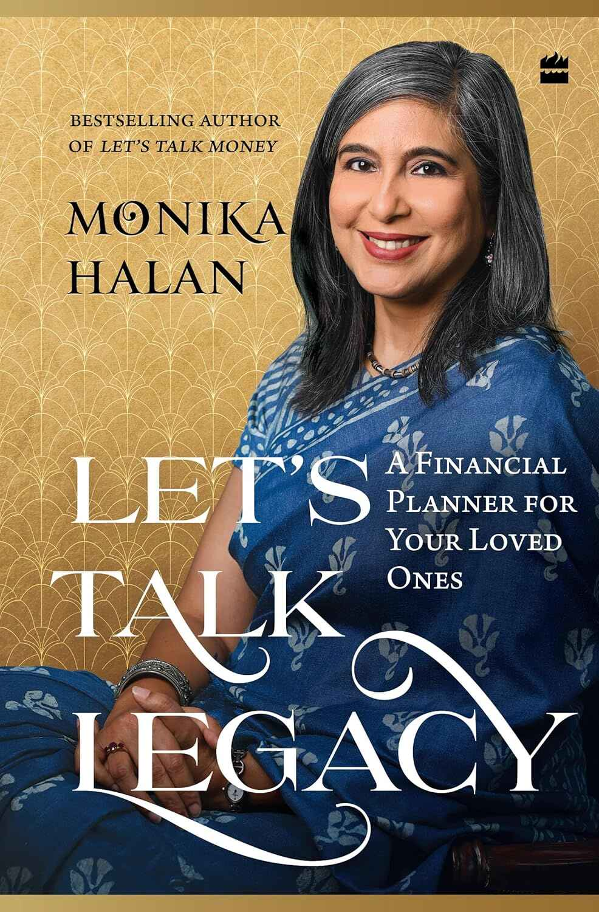

Here's a booktalk for "Let's Talk Legacy: A Financial Planner for Your Loved Ones" by Monika Halan.

2024 was an incredible year for my reading journey, especially in the realm of personal finance. Among the many books I read, one that truly stands out is "Let's Talk Legacy: A Financial Planner for Your Loved Ones" by Monika Halan. This book has become an essential addition to my financial library.

> This is a work book which goes into bank locker and not your bookshelf

**Anticipation and Initial Reactions**

I eagerly followed this book from its pre-launch phase, but it initially left some young readers disappointed. They had certain expectations for a financial book, such as:

- A clear algorithmic or logical process.
- Over 225 pages of paperback content.
- A Bollywood-style happy ending that makes you feel like you've achieved your Financial Independence, Retire Early (FIRE) goals.

**What the Book Actually Offers**

However, "Let's Talk Legacy" offers something different:

- Approximately 20 pages of insightful content and over 100 pages of practical worksheets.
- A focus on planning for the inevitable, rather than achieving FIRE goals.
- Encouraging active participation with pen and paper, rather than simply clicking a payment button.

Despite facing early criticism and poor reviews, the book has reversed trend and earned its rightful place on the bookshelves.

**Who Should Read This Book?**

This book is a must-read for anyone who believes in the importance of insurance products. Let's break it down:

- We buy insurance to ensure our family's well-being during unforeseen events.
- But what if our assets remain inaccessible?
- What if we haven’t made a will, added relevant nominees, or even discussed insurance within the family?

This book aims to help you get organized, making it easier for your loved ones to access your assets when you are no longer around.

## 3 Big Ideas from Let's Talk Legacy

### 1. Use a Simple Approach

We often overcomplicate security measures, password-protecting everything from phones to lockers. The author suggests a simpler method: write down all necessary details in the provided worksheets and store the book in a secure place or bank locker. When your nominees access the locker, they will find everything neatly laid out.

### 2. List All Assets

Create an inventory of all types of assets on the worksheets provided in the book with verbose details, including:

- Bank accounts
- Real estate
- Stocks and securities
- Collectibles
- Government documents like passports

### 3. Make a Will Document

A will is essential for anyone with assets and above the age of 18. It specifies how you want to distribute your assets after you pass away. The author provides a template for creating a will, making the process straightforward.

## Summary

This book isn't about making money through tactical or strategic methods. Instead, it's about ensuring your wealth is passed on smoothly to your loved ones. It's not a book for passive reading but an interactive guide that requires you to sit down with a pen and paper. Remember to update the worksheets regularly. This book's place is in your locker, not just on your bookshelf.

So, if you're looking for a practical and thoughtful guide to planning your financial legacy, _"Let's Talk Legacy"_ is a must-read!
